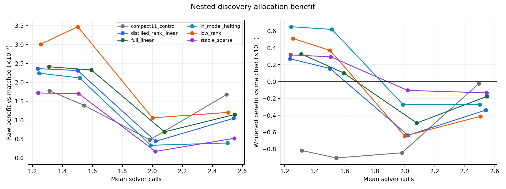
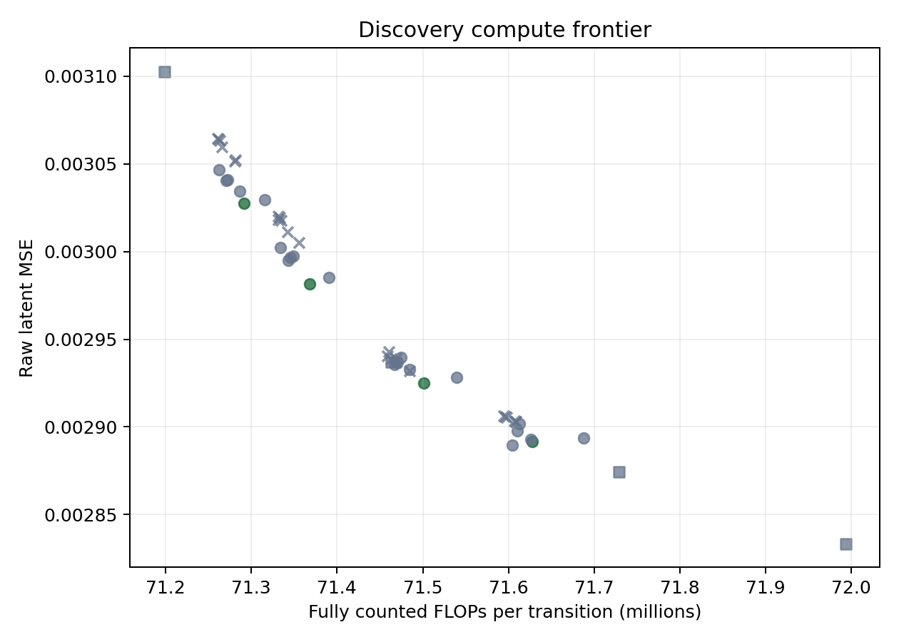
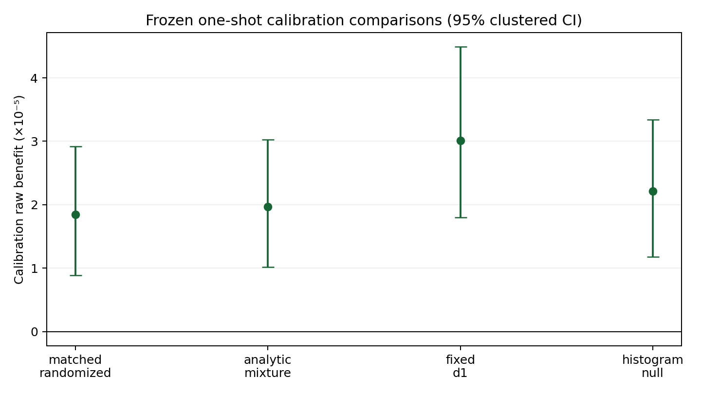
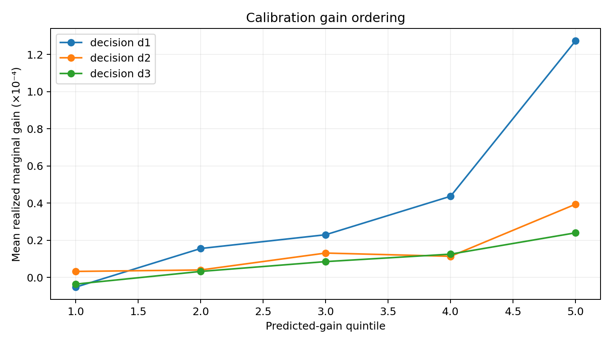
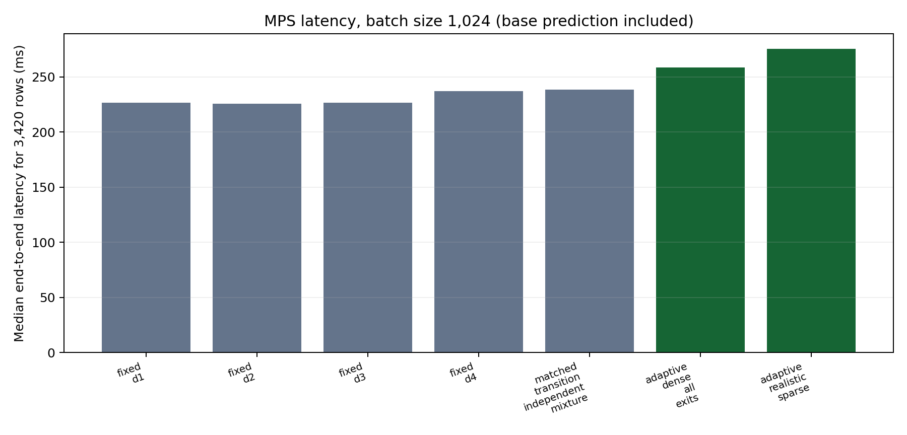

# LeWM Critic-Compression Discovery Report

## Decision

**`critic_compression_discovery_passed`**.

A single full-coordinate regularized linear gate passed two-repeat grouped nested discovery CV and the frozen one-shot V3 calibration judge. This supports a cheap causal allocation mechanism for the unchanged visual-latent stagewise LeWM solver. It is not fresh-data confirmation: all 420 V3 training episodes were discovery data, the 90-episode V3 calibration split has now been consumed exactly once, V3 test targets remain untouched, and no V4 data was created. The next step is a separate preregistered V4 confirmation.

## Core result

The deployed student is one shared 1,046-coordinate linear head with causal depth encoding, 1,050 parameters (4,200 parameter bytes), no ensemble, and no teacher at inference. Its fully counted incremental maximum is 8,196 FLOPs per evaluated decision—3.1% of a 264,960-FLOP later-stage adapter and well below the 66,240 cap.

| evaluation | calls | adaptive raw MSE | matched raw MSE | benefit | clustered 95% CI | whitened benefit |
| --- | ---: | ---: | ---: | ---: | ---: | ---: |
| nested discovery (420 episodes) | 1.311 | 0.003027306 | 0.003051428 | 0.000024123 | [0.000018362, 0.000029864] | 0.0003264 |
| one-shot calibration (90 episodes) | 1.254 | 0.003131435 | 0.003149907 | 0.000018472 | [0.000008881, 0.000029195] | 0.0003402 |

Calibration also beat the analytic expected mixture by 0.000019704 (CI lower 0.000010154), fixed d1 by 0.000030084 (CI lower 0.000017983), and the exact histogram null by 0.000022173 (CI lower 0.000011768). The whitened direction was positive (0.0003402) but its CI included zero [-0.0001031, 0.0008317]; the frozen rule required positive direction, not whitened significance.

## Solver and isolation

The selected checkpoint remained byte-identical at SHA-256 `e63277943a356f3e28b4c4d1a1eb56acc8771fc07eccccdca67f878fed5ba782`. d0 identity, d0 bitwise equality, and d1 bitwise equality passed before and after student training and again on calibration. Solver state hashes did not change and solver gradients remained absent. The old 84-episode evidence reproduced d1 0.003120225 and d4 0.003048932.

Only the isolated train-only cache was opened during discovery. The old combined V3 target NPZ was checked opaquely by hash and never loaded with NumPy. The calibration receipt was created before direct source-HDF5 target extraction; its cache contains exactly 90 calibration episodes and no test episode.

## Candidate ladder and failure diagnosis

The prior rich critic remained training-time teacher/diagnostic only. Its repeated OOF Spearman correlations were 0.285, 0.230, and 0.186. The full linear student showed weaker but useful routing correlations (0.171, 0.183, 0.150) and won because it retained allocation benefit at very low cost. The distilled-ranking linear family also passed at low-call points but was not selected by the frozen effect/frontier rule.

The 11-summary control again failed because whitened effects were negative at every operating point. Stable sparse raw-coordinate models preserved some raw benefit but no point satisfied the global call/FLOP frontier. The low-rank bottleneck had the strongest rank signal and raw allocation effects, but its 39,874-FLOP gate was FLOP-dominated by the linear winner. The in-model current/update head was cheaper and whitened-positive at low calls, but globally dominated. Thus full raw-coordinate information is linearly accessible; aggressive sparsification loses enough routing value; low-rank capacity is not the limiting factor; whitening still exposes motion/scale shortcuts in compact/deeper policies.

## Compute and latency

At calibration the adaptive point used 71.276M total FLOPs per transition versus 71.266M for the matched mixture and remained nondominated in both call and FLOP frontiers. Gate components per decision were 3,998 feature-construction, 2,098 normalization, 2,099 linear-head, and 1 control-flow FLOPs.

On MPS for all 3,420 calibration rows at batch size 1,024, end-to-end medians including the common base predictor were 226.6 ms fixed d1, 237.2 ms fixed d4, 238.6 ms matched mixture, 258.3 ms dense adaptive, and 275.2 ms realistic sparse adaptive. Sparse routing was slower than dense routing on this device despite executing fewer solver rows, indicating indexing/synchronization overhead. FLOPs, latency, and energy are different notions; energy was not measured and latency was not substituted for the frozen FLOP rule.

Sparse execution processed exactly 4,288 solver rows, matched the frozen calls, and agreed with dense selected outputs within 2.38419e-7.

## Calibration interpretation

Calibration gain ordering remained positive but modest (Spearman 0.134, 0.093, 0.126 by decision). The score-permutation negative control did not significantly beat its own matched mixture. No contact, impact, regime, privileged state, future value, episode-global statistic, target, or test-derived statistic was available to the gate. This result does not justify calling the mechanism contact-aware and does not claim a first adaptive world model.

## Reproduction

```bash
PY=/Users/rishisim/.cache/lewm-v2-venv/bin/python
PYTHONDONTWRITEBYTECODE=1 "$PY" -m unittest discover -s runs/lewm_adaptive_compute_critic_compression/tests -v
PYTHONDONTWRITEBYTECODE=1 "$PY" runs/lewm_adaptive_compute_critic_compression/run_experiment.py prepare --device mps
PYTHONDONTWRITEBYTECODE=1 "$PY" runs/lewm_adaptive_compute_critic_compression/run_experiment.py smoke --device mps
PYTHONDONTWRITEBYTECODE=1 "$PY" runs/lewm_adaptive_compute_critic_compression/run_experiment.py discovery --device mps
# judge is one-shot and has already been consumed; do not rerun
PYTHONDONTWRITEBYTECODE=1 "$PY" runs/lewm_adaptive_compute_critic_compression/runtime_audit.py --device mps
PYTHONDONTWRITEBYTECODE=1 "$PY" runs/lewm_adaptive_compute_critic_compression/make_artifacts.py
```

The frozen tournament hash is `5f474b17a37cc05c39b66495aad0baceb7c7ec4913eb3d6b2966eae230e52b66`. Full nested metrics, exact calls, intervals, checkpoints, hashes, test logs, tables, and plots are under this run directory.

## Figures










