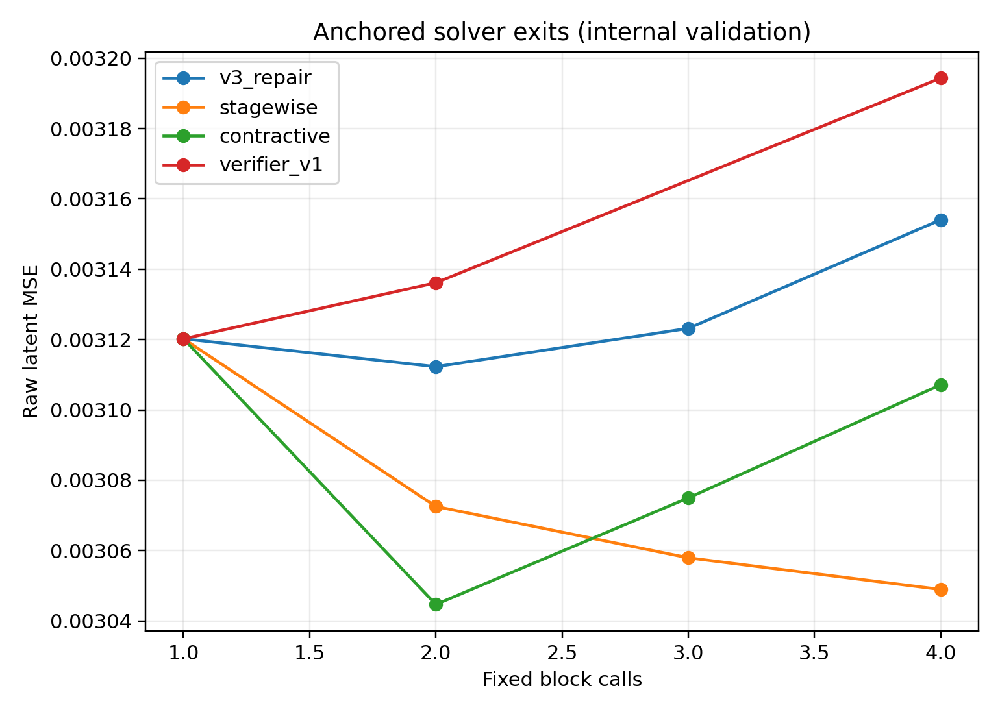
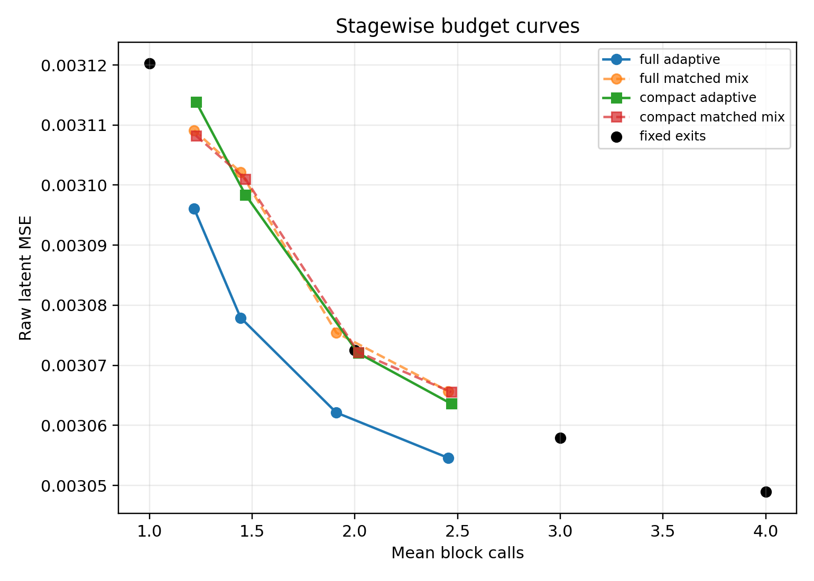
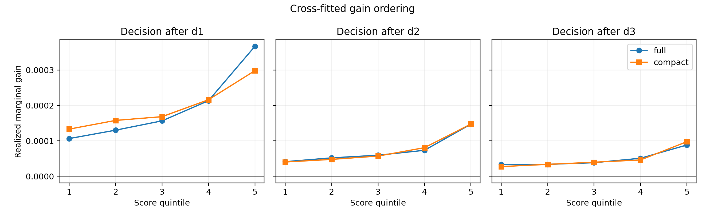
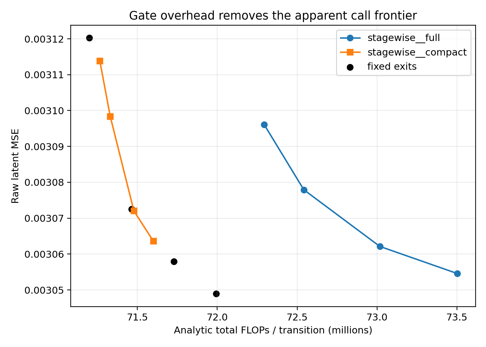
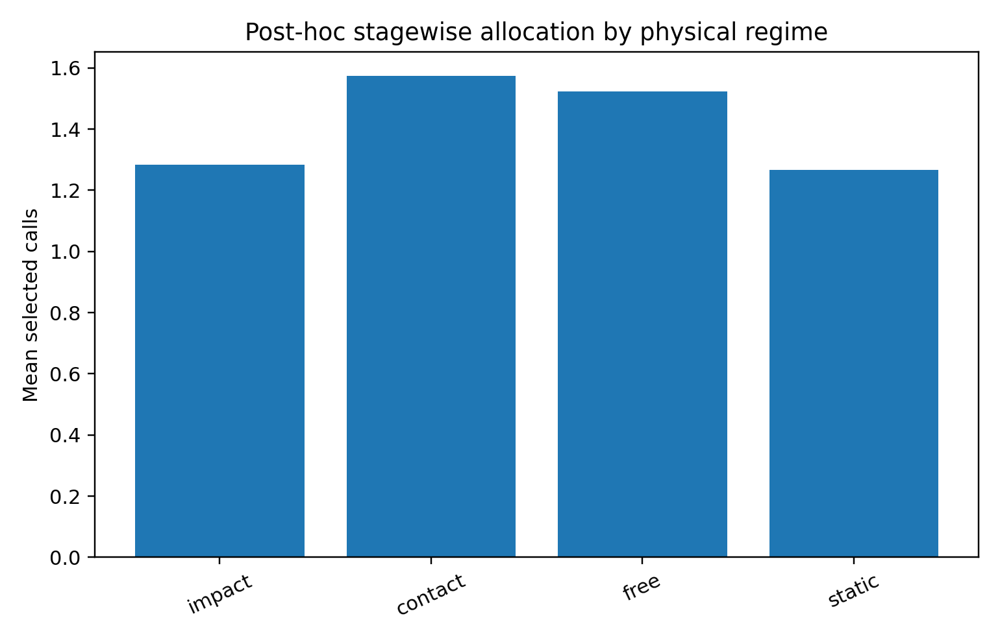

# LeWM Adaptive Compute Discovery Report

## Decision

**`discovery_gate_failed`**.

The anchored solver hypothesis succeeded, but the adaptive-compute hypothesis
did not survive honest gate-overhead and robustness accounting. No candidate
passed every episode-held-out internal criterion. The sealed V3 calibration
judge was therefore not created or consumed, V3 test targets were never
extracted or loaded, no fresh episode was generated, and
`runs/lewm_adaptive_compute_v4/` was not created.

This is a negative adaptive-compute result, not a negative solver result. The
stagewise zero-initialized residual cascade preserved the known-good V1 first
exit bitwise and improved every later fixed exit across all three seeds. Its
rich causal critic also allocated computation usefully at matched block calls.
But the three-model full-feature critic cost more than three stage-adapter calls
per decision, so every apparently useful adaptive point was dominated in
actual FLOPs. The cheap compact critic restored a plausible compute budget but
lost the transition-independent matched-mixture comparison and reversed in the
whitened robustness metric.

## Isolation and validity

- Discovery re-extracted only the 420 V3 training episodes into a physically
  separate train-only cache. It split them by episode into 336 discovery-fit
  and 84 internal-validation episodes (12,768 and 3,192 transitions).
- The old V3 combined NPZ was checked only as an opaque file hash and never
  opened with NumPy because its target member co-mingles train, calibration,
  and forbidden test targets.
- No `calibration_access_receipt.json`, calibration cache, or frozen final
  tournament exists. The 90 V3 calibration episodes remain untouched.
- All d0/d1 anchor audits, real-candidate gradient-boundary audits, and sparse
  runtime call/output audits passed. Sparse selected execution differed from
  dense gathered exits by at most `2.38419e-7` and processed exactly
  `sum(selected_depth)` rows.
- Critics accept only detached NumPy features. Actual solver state hashes were
  identical before and after critic fitting, solver gradients remained absent,
  and critic gradients were finite/nonzero at every depth.
- Contact, impact, and motion labels were attached only after the primary
  failure decision, for the descriptive regime plot.

The released checkpoint still lacks a pretraining episode manifest. These
episodes are isolated from the recorded V1/V2/V3 diagnostics, but they cannot
be proven unseen during original LeWM pretraining.

## Forensic V3 audit

All seven suspected V3 defects were confirmed in code and artifacts:

1. Gate regression, price, and ranking gradients flowed through live causal
   features into the refiner. A synthetic gate-only backward gave refiner
   gradient norm `0.0506`.
2. `relu(L_later - L_earlier)` could reduce its objective by worsening the
   earlier exit.
3. Feature and gain normalization was fit once before the refiner changed and
   then remained stale.
4. At epoch 1, weighted gate terms contributed about `99.9%` of the objective;
   for the selected seed, raw deep MSE was `0.01329` while weighted gate
   regression alone was about `13.18`.
5. Epoch 0 was ineligible. All three selected epoch-1 checkpoints had already
   changed every V1 refiner tensor element.
6. The pretrained refiner and random gate shared one optimizer, learning rate,
   and weight decay.
7. Stochastic maximum depth was drawn once per arbitrary row batch rather than
   per episode/sequence.

This strongly supports the diagnosis that V3's catastrophic d1 collapse was an
optimization/implementation failure. It does not by itself establish a useful
adaptive frontier.

## Solver results

On internal validation, the immutable anchor had d0 raw MSE `0.0042132312` and
d1 `0.0031202247`, a `25.94%` reduction. Thus the previously unarchived
V1-initialization diagnostic is now independently reproduced on a mechanically
isolated V3-train subset.

The primary stagewise cascade was stable across all three seeds. The selected
seed's fixed exits were:

| exit | raw MSE | gain vs d1 | clustered 95% CI lower |
| ---: | ---: | ---: | ---: |
| d1 | 0.003120225 | 0 | 0 |
| d2 | 0.003072531 | 0.000047694 | 0.000035342 |
| d3 | 0.003057936 | 0.000062288 | 0.000046264 |
| d4 | 0.003048932 | 0.000071293 | 0.000052981 |

Every stage passed its predecessor-improvement gate in every seed. Earlier
exits were detached/frozen, new adapters began as exact no-ops, and epoch 0 was
eligible. This is positive evidence for anchored stagewise refinement.

The repaired-V3 control preserved d1 and achieved only a small d2 improvement:
MSE `0.003112283`, gain `7.94e-6`, CI lower `4.47e-6`; deeper shared calls
drifted. The contractive solver's d2 was strong (`0.003044670`) but later exits
relaxed back toward worse values. Frozen V1 reuse regressed at d2 and d4,
confirming that naive repeated calls are not a sufficient solver.

## Why adaptive computation failed

The full stagewise critic had ordered realized-gain quintiles and positive
strict-OOF Spearman correlations `0.254`, `0.234`, and `0.190` after d1/d2/d3.
At block-call budgets it passed demanding comparisons. For example:

| mean calls | adaptive MSE | matched mixture MSE | benefit | CI lower |
| ---: | ---: | ---: | ---: | ---: |
| 1.217 | 0.003096114 | 0.003109141 | 0.000013026 | 0.000004795 |
| 1.444 | 0.003077927 | 0.003102152 | 0.000024225 | 0.000015609 |
| 1.910 | 0.003062127 | 0.003075439 | 0.000013312 | 0.000006062 |
| 2.455 | 0.003054586 | 0.003065690 | 0.000011104 | 0.000006801 |

These effects also beat the analytic expected mixture, fixed d1, and the exact
histogram null at the listed points. They are real allocation signal—not a
uniform-depth artifact.

However, one full `[1046,128,64,1]` critic costs `284,288` dense-linear FLOPs.
The three-member LCB ensemble therefore costs `852,864` FLOPs per decision,
versus `264,960` per later stage adapter and `669,184` for the frozen V1 call.
At 1.444 calls the adaptive point used `72.542M` total latent-prediction FLOPs
per transition and MSE `0.003077927`; fixed d4 used only `71.993M` FLOPs and
achieved `0.003048932`. Every full-critic adaptive point was FLOP-dominated.
On the 3,192-transition internal-validation set, the corresponding sparse
solver path took `55.75 ms` median and the prebuilt critic MLPs another
`4.31 ms` median (`60.05 ms` component sum). These timings exclude the common
base predictor and causal feature construction, so FLOPs—not this partial
latency measurement—remain the primary exact compute accounting.

The preregistered pre-calibration adversarial refinement tested a compact
11-summary-feature `[11,32,16,1]` ensemble costing only `5,280` FLOPs per
decision. Its OOF stagewise correlations remained positive (`0.140`, `0.235`,
`0.216`) with ordered quintiles, but that compressed signal did not allocate
well enough. At about 1.47 calls it achieved MSE `0.003098414` versus
`0.003101049` for the exact matched mixture, but the benefit CI included zero
(`CI lower -4.4e-6`). Across operating points its whitened benefit versus the
matched mixture was negative; at this point it was `-0.0005294` with CI lower
`-0.0008856`. Its sparse solver path took `46.66 ms` median and critic MLPs
`1.18 ms` median (`47.84 ms` component sum) on the same set. Cheap gating
therefore failed, while effective gating was too expensive.

The verifier-only frozen-V1 policy produced one nominal passing allocation
point, but every fixed later V1 exit significantly regressed from d1, violating
the required later-exit/no-regression gate. It cannot advance.

## Post-hoc physical regimes

The descriptive 1.5-call stagewise-full policy allocated mean calls `1.57` in
contact, `1.52` in other free motion, `1.28` at impact, and `1.27` in static
transitions. These labels were unavailable to every solver and critic and were
attached after the verdict. They do not establish a contact-aware mechanism.

## Adversarial verification and negative controls

- Prices were calibrated from strict cross-fitted discovery-fit scores, not
  predictions from models that had trained on the same rows.
- Both an exact seeded transition-independent mixture and its analytic expected
  loss were required. Results were also checked against fixed d1, all deeper
  exits, exact histogram randomization, and a label-free score permutation.
- Passing required positive clustered-CI lower bounds against matched mixture,
  analytic mixture, fixed d1, and histogram null, plus both call- and
  FLOP-nondominance.
- Raw MSE remained primary; discovery-fit whitening was frozen prospectively
  and reported as robustness.
- Full and compact critics, mean and LCB ensemble scores, budgets near 1.25,
  1.5, 2.0, and 2.5 calls, three stagewise solver seeds, and two seeds for each
  other trained solver were evaluated. Negative results were retained.

## Precise next scientific recommendation

Do not spend fresh-data compute yet. The next experiment should preserve the
successful stagewise solver exactly and target only the critic cost–signal
tradeoff under a hard predeclared gate budget, for example no more than
`0.25` stage-adapter-equivalent FLOPs per decision. A promising falsifiable
design is cross-fitted teacher-to-student ranking distillation: use the rich
full critic only as a discovery-fit teacher, train one small low-rank/shared
student on teacher ordering plus realized gain, and require the student itself
to recover matched-mixture advantage, whitened direction, and FLOP
nondominance on episode-held-out internal validation. If it fails, conclude
that the currently available causal signal is too expensive to exploit.

The untouched V3 calibration judge should remain sealed until that prospective
student and all rules are frozen. Do not relax the gate by reverting to
block-call-only accounting.

## Reproduction

```bash
PY=/Users/rishisim/.cache/lewm-v2-venv/bin/python

PYTHONDONTWRITEBYTECODE=1 "$PY" -m unittest discover \
  -s runs/lewm_adaptive_compute_discovery/tests -v

PYTHONDONTWRITEBYTECODE=1 "$PY" \
  runs/lewm_adaptive_compute_discovery/extract_isolated.py train --device mps

PYTHONDONTWRITEBYTECODE=1 "$PY" \
  runs/lewm_adaptive_compute_discovery/run_discovery.py fit --device mps

PYTHONDONTWRITEBYTECODE=1 "$PY" \
  runs/lewm_adaptive_compute_discovery/make_artifacts.py
```

`judge` was intentionally not run. Machine-readable verdict:
`{"decision":"discovery_gate_failed"}`.

## Figures










