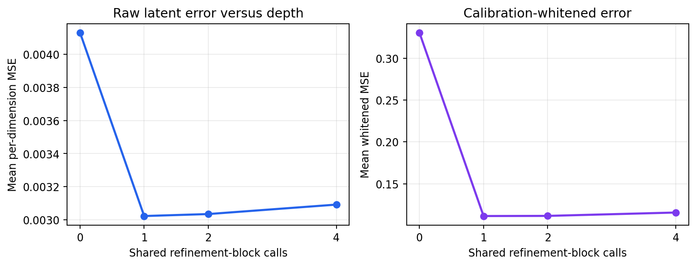
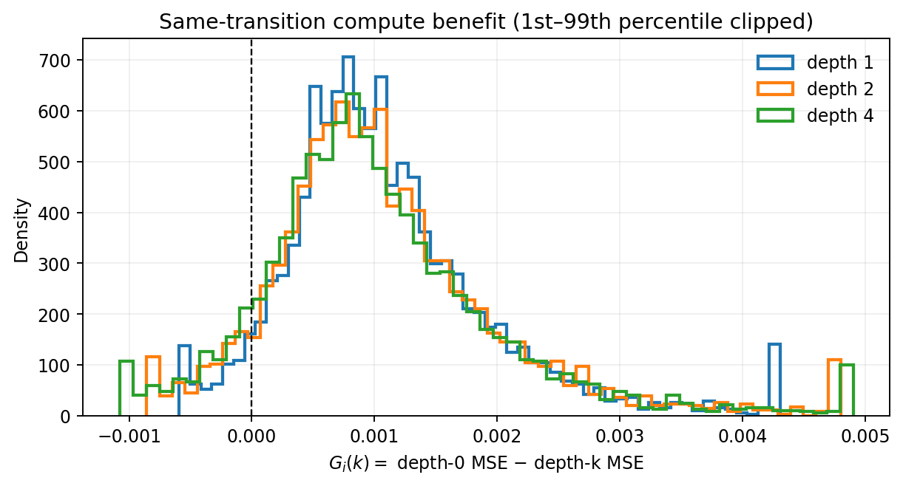
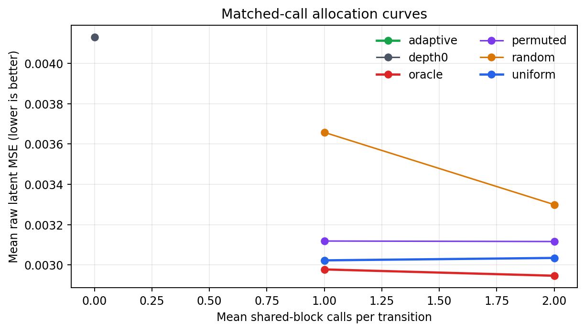
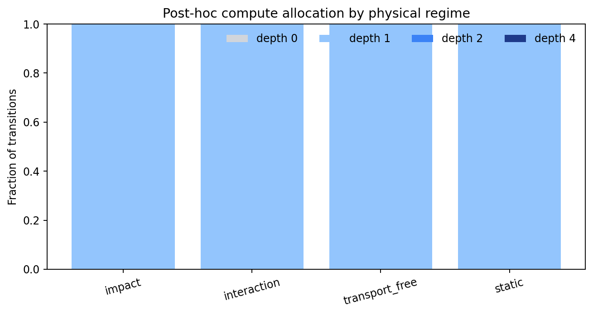

# Direct LeWM Adaptive Compute Pilot

## Decision

**`selective_headroom_gate_failed`** — The exact-budget oracle showed selective headroom, but the frozen causal gate failed at least one required test comparison.

The primary frozen-LeWM depth-0 raw MSE was `0.00413055`.
The best fixed depth was `1` with raw MSE
`0.00302289` and same-transition gain
`0.00110766` (episode-clustered 95% CI
`[0.00106293, 0.00115092]`). The
largest diagnostic oracle advantage over matched uniform compute was
`8.82368e-05` at mean budget
`2` calls (CI
`[8.07576e-05, 9.61001e-05]`).

## Validity

- Depth 0 is bitwise identical to the direct released LeWM prediction cache.
- Released checkpoint loading was strict; all 18,034,628 base parameters were frozen.
- Train/calibration/test episodes are pairwise disjoint and prior Cube diagnostic episodes 0--29 were excluded.
- Refiner and gate inputs contain only latent/action history, the current prediction, and iteration information.
- Whitening, primary-seed choice, physical-regime thresholds, and any gate budget were calibration-only.
- Test metrics were computed only after calibration screening and gate/budget freezing.
- Oracle allocations use target error and are diagnostic upper bounds, never gate features.
- Latent MSE is not interpreted as proof of physical grounding.

The released checkpoint has no episode-level pretraining manifest. These test
episodes are fresh to the contact diagnostics and refiner, but cannot be proven
unseen during original LeWM pretraining.

## Error versus depth

| depth | raw_mean_loss | whitened_mean_loss | mean_gain | gain_ci_low | gain_ci_high | mean_robust_relative_gain |
| --- | --- | --- | --- | --- | --- | --- |
| 0 | 0.00413055 | 0.330337 | 0 | 0 | 0 | 0 |
| 1 | 0.00302289 | 0.111402 | 0.00110766 | 0.00106293 | 0.00115092 | 0.28943 |
| 2 | 0.00303483 | 0.111568 | 0.00109572 | 0.00104738 | 0.00114156 | 0.279169 |
| 4 | 0.003092 | 0.115588 | 0.00103854 | 0.000989579 | 0.0010855 | 0.259276 |

## Matched-call allocation

| mean_budget | strategy | total_calls | raw_mean_loss | mean_gain_vs_depth0 | mean_advantage_vs_uniform | advantage_vs_uniform_ci_low | advantage_vs_uniform_ci_high |
| --- | --- | --- | --- | --- | --- | --- | --- |
| 0 | depth0 | 0 | 0.00413055 |  |  |  |  |
| 1 | uniform | 3420 | 0.00302289 | 0.00110766 | 0 | 0 | 0 |
| 1 | oracle | 3420 | 0.00297791 | 0.00115263 | 4.49721e-05 | 3.7348e-05 | 5.34714e-05 |
| 1 | random | 3420 | 0.0036575 | 0.000473048 | -0.000634612 | -0.000671012 | -0.00060125 |
| 1 | permuted | 3420 | 0.00311869 | 0.00101186 | -9.5799e-05 | -0.00011034 | -8.09541e-05 |
| 2 | uniform | 6840 | 0.00303483 | 0.00109572 | 0 | 0 | 0 |
| 2 | oracle | 6840 | 0.00294659 | 0.00118396 | 8.82368e-05 | 8.07576e-05 | 9.61001e-05 |
| 2 | random | 6840 | 0.00329935 | 0.000831199 | -0.00026452 | -0.00029172 | -0.000238596 |
| 2 | permuted | 6840 | 0.00311626 | 0.00101429 | -8.14291e-05 | -0.000100839 | -6.53494e-05 |
| 1 | adaptive | 3420 | 0.00302289 | 0.00110766 |  |  |  |

## Learned causal gate

| comparison | mean_benefit | ci_low | ci_high | passed |
| --- | --- | --- | --- | --- |
| adaptive_vs_depth0 | 0.00110766 | 0.00106293 | 0.00115092 | True |
| adaptive_vs_uniform | 0 | 0 | 0 | False |
| adaptive_vs_random | 0.000641345 | 0.0006056 | 0.000678073 | None |
| adaptive_vs_permuted | 0 | 0 | 0 | None |
| oracle_regret | 4.49721e-05 | 3.7348e-05 | 5.34714e-05 | None |

## Post-hoc physical regimes

Contact, impact, transport-free motion, and static labels below are used only
for interpretation; they were unavailable to both the refiner and gate.

| regime | n | mean_selected_depth | mean_gain_vs_depth0 |
| --- | --- | --- | --- |
| impact | 197 | 1 | 0.00104368 |
| interaction | 1464 | 1 | 0.00110037 |
| transport_free | 1618 | 1 | 0.00113205 |
| static | 141 | 1 | 0.000992872 |

## Compute and provenance

- Trainable shared-refiner parameters: `335360`.
- Estimated dense-linear FLOPs per refinement-block call: `669184`.
- Selected-policy calls: `3420`.
- Selected-policy estimated dense-linear FLOPs: `2288609280`.
- Selected-policy median measured latency: `0.0296265` seconds on `mps`.
- Checkpoint SHA-256: `2839a907362f403f9136383016e91774373a295d958ae75121791f22a9fddf89`.
- Source HDF5: `/Users/rishisim/.stable_worldmodel/source_downloads/lewm-cube/extracted/cube_single_expert.h5`.
- Split/cache manifest: `cache/split_manifest.json`.
- Configuration: `full_config.json`.

## Figures

## Limitations and next gate

This is one released Cube checkpoint and one small shared-refiner family. A
negative result rules out this pilot architecture/objective, not all iterative
LeWM computation. A positive oracle result without a learned-gate result calls
for better causal uncertainty/convergence features, not target-derived regime
features. A learned-gate success should next be replicated across checkpoint
seeds and another physical domain before control or novelty claims.
