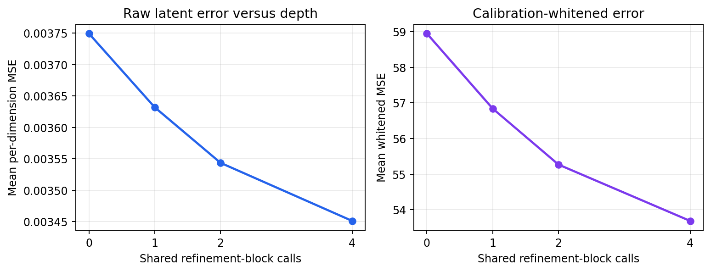
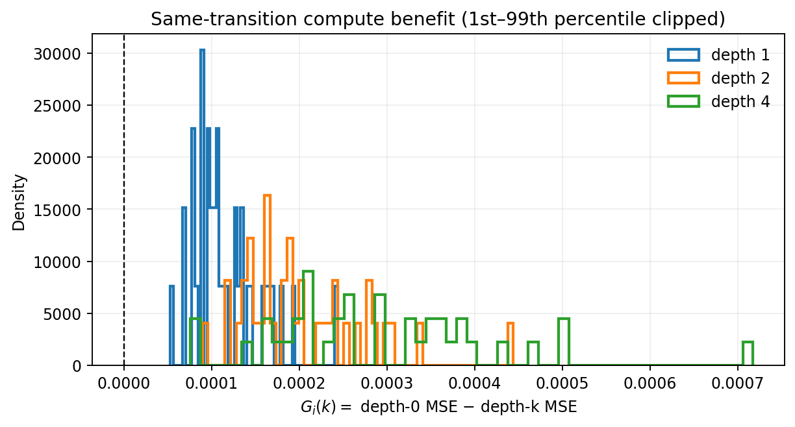
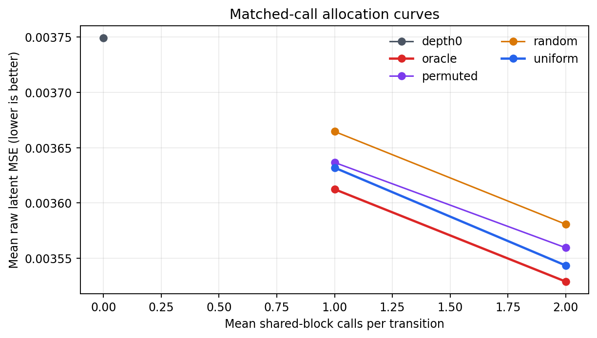
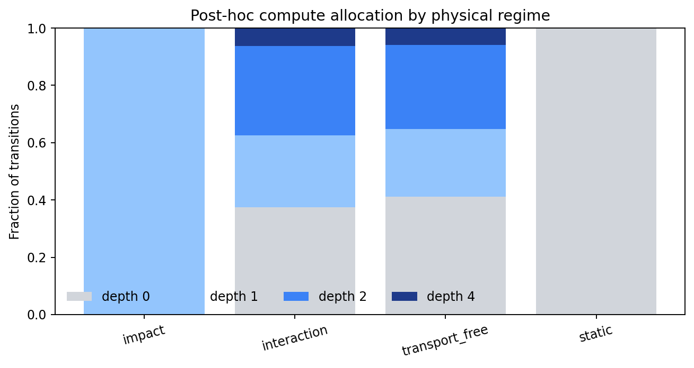

# Direct LeWM Adaptive Compute Pilot

## Decision

**`selective_headroom_gate_failed`** — Test oracle headroom exists, but the causal gate was not fit because the calibration-only Stage A screen failed.

The primary frozen-LeWM depth-0 raw MSE was `0.00374925`.
The best fixed depth was `4` with raw MSE
`0.00345116` and same-transition gain
`0.000298094` (episode-clustered 95% CI
`[0.000298094, 0.000298094]`). The
largest diagnostic oracle advantage over matched uniform compute was
`1.9472e-05` at mean budget
`1` calls (CI
`[1.9472e-05, 1.9472e-05]`).

## Validity

- Depth 0 is bitwise identical to the direct released LeWM prediction cache.
- Released checkpoint loading was strict; all 18,034,628 base parameters were frozen.
- Train/calibration/test episodes are pairwise disjoint and prior Cube diagnostic episodes 0--29 were excluded.
- Refiner and gate inputs contain only latent/action history, the current prediction, and iteration information.
- Whitening, primary-seed choice, physical-regime thresholds, and any gate budget were calibration-only.
- Test metrics were computed only after calibration screening and gate/budget freezing.
- Oracle allocations use target error and are diagnostic upper bounds, never gate features.
- Latent MSE is not interpreted as proof of physical grounding.

The released checkpoint has no episode-level pretraining manifest. These test
episodes are fresh to the contact diagnostics and refiner, but cannot be proven
unseen during original LeWM pretraining.

## Engineering smoke caveat

This six-episode run validates the pipeline only; its one-episode calibration/test summaries do not support scientific claims.

## Error versus depth

| depth | raw_mean_loss | whitened_mean_loss | mean_gain | gain_ci_low | gain_ci_high | mean_robust_relative_gain |
| --- | --- | --- | --- | --- | --- | --- |
| 0 | 0.00374925 | 58.9505 | 0 | 0 | 0 | 0 |
| 1 | 0.00363186 | 56.8423 | 0.00011739 | 0.00011739 | 0.00011739 | 0.036243 |
| 2 | 0.00354351 | 55.268 | 0.000205741 | 0.000205741 | 0.000205741 | 0.0632214 |
| 4 | 0.00345116 | 53.6854 | 0.000298094 | 0.000298094 | 0.000298094 | 0.0902466 |

## Matched-call allocation

| mean_budget | strategy | total_calls | raw_mean_loss | mean_gain_vs_depth0 | mean_advantage_vs_uniform | advantage_vs_uniform_ci_low | advantage_vs_uniform_ci_high |
| --- | --- | --- | --- | --- | --- | --- | --- |
| 0 | depth0 | 0 | 0.00374925 |  |  |  |  |
| 1 | uniform | 38 | 0.00363186 | 0.00011739 | 0 | 0 | 0 |
| 1 | oracle | 38 | 0.00361239 | 0.000136862 | 1.9472e-05 | 1.9472e-05 | 1.9472e-05 |
| 1 | random | 38 | 0.00366456 | 8.46948e-05 | -3.26949e-05 | -3.26949e-05 | -3.26949e-05 |
| 1 | permuted | 38 | 0.00363657 | 0.000112678 | -4.71177e-06 | -4.71177e-06 | -4.71177e-06 |
| 2 | uniform | 76 | 0.00354351 | 0.000205741 | 0 | 0 | 0 |
| 2 | oracle | 76 | 0.00352897 | 0.00022028 | 1.45387e-05 | 1.45387e-05 | 1.45387e-05 |
| 2 | random | 76 | 0.00358077 | 0.000168483 | -3.72579e-05 | -3.72579e-05 | -3.72579e-05 |
| 2 | permuted | 76 | 0.00355955 | 0.000189701 | -1.60395e-05 | -1.60395e-05 | -1.60395e-05 |

## Learned causal gate

(not applicable)

## Post-hoc physical regimes

Contact, impact, transport-free motion, and static labels below are used only
for interpretation; they were unavailable to both the refiner and gate.

| regime | n | mean_selected_depth | mean_gain_vs_depth0 |
| --- | --- | --- | --- |
| impact | 2 | 1 | 0.000126383 |
| interaction | 16 | 1.125 | 0.000164233 |
| transport_free | 17 | 1.05882 | 0.000136485 |
| static | 3 | 0 | 0 |

## Compute and provenance

- Trainable shared-refiner parameters: `71200`.
- Estimated dense-linear FLOPs per refinement-block call: `141696`.
- Selected-policy calls: `38`.
- Selected-policy estimated dense-linear FLOPs: `5384448`.
- Selected-policy median measured latency: `nan` seconds on `mps`.
- Checkpoint SHA-256: `2839a907362f403f9136383016e91774373a295d958ae75121791f22a9fddf89`.
- Source HDF5: `/Users/rishisim/.stable_worldmodel/source_downloads/lewm-cube/extracted/cube_single_expert.h5`.
- Split/cache manifest: `cache/split_manifest.json`.
- Configuration: `smoke_config.json`.

## Figures

## Limitations and next gate

This is one released Cube checkpoint and one small shared-refiner family. A
negative result rules out this pilot architecture/objective, not all iterative
LeWM computation. A positive oracle result without a learned-gate result calls
for better causal uncertainty/convergence features, not target-derived regime
features. A learned-gate success should next be replicated across checkpoint
seeds and another physical domain before control or novelty claims.
