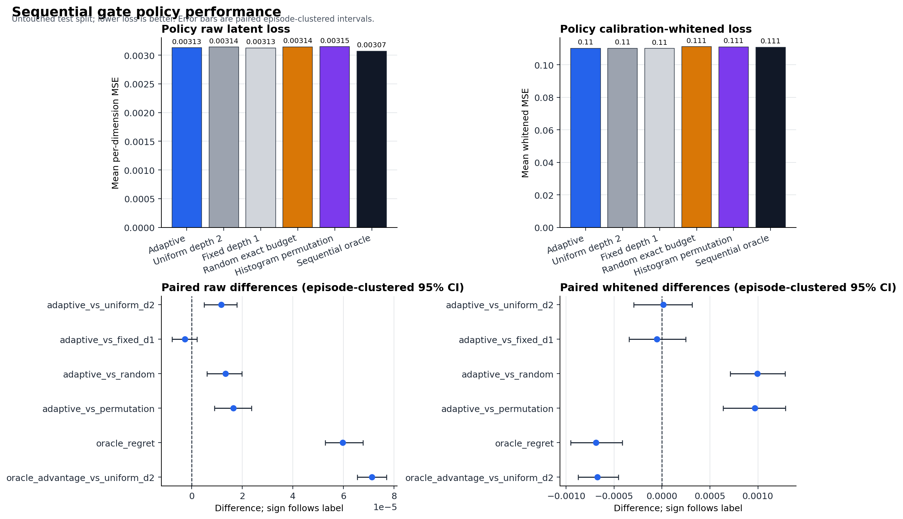
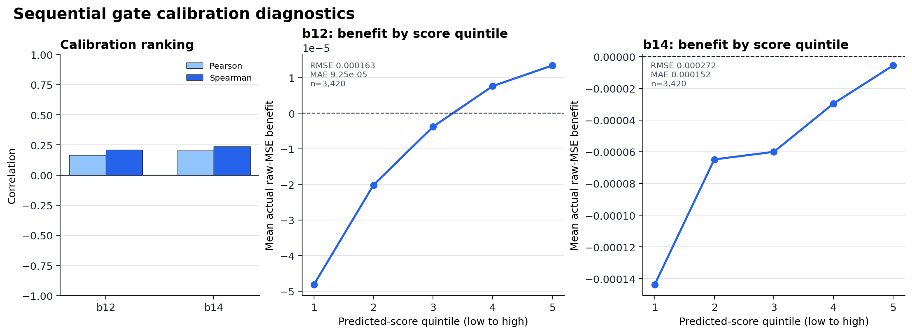
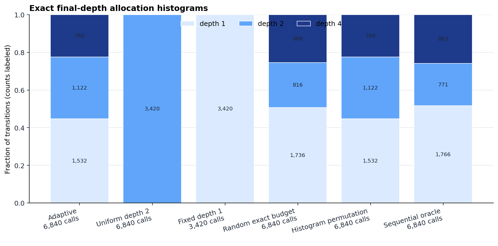
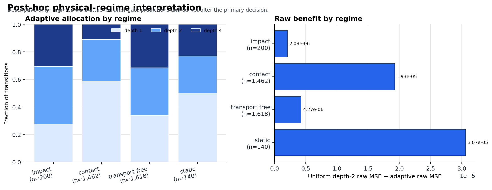

# LeWM Adaptive Compute V2 Report

## Frozen decision

**`sequential_headroom_gate_failed`** — Sequential oracle headroom exists, but the frozen gate failed at least one preregistered raw-MSE comparison or exact-budget requirement.

The confirmatory policy executed the first frozen-refiner call for every
transition, then assigned final depths from `{1,2,4}` at exactly `2N` total
calls. The primary claim is transition-selective latent computation, not
physical grounding or contact-specific compute benefit.

## Untouched-test policies

| policy | raw_mean_loss | whitened_mean_loss | depth_1 | depth_2 | depth_4 | total_calls | mean_calls |
| --- | --- | --- | --- | --- | --- | --- | --- |
| adaptive | 0.003129704 | 0.1101743 | 1532 | 1122 | 766 | 6840 | 2 |
| uniform_d2 | 0.003141346 | 0.1101872 | 0 | 3420 | 0 | 6840 | 2 |
| fixed_d1 | 0.00312694 | 0.1101208 | 3420 | 0 | 0 | 3420 | 1 |
| random | 0.003142987 | 0.11117 | 1736 | 816 | 868 | 6840 | 2 |
| permutation | 0.003146189 | 0.1111426 | 1532 | 1122 | 766 | 6840 | 2 |
| oracle | 0.003070055 | 0.110863 | 1766 | 771 | 883 | 6840 | 2 |

## Paired episode-clustered comparisons

Positive benefit favors the named adaptive/oracle side. Intervals are 95%
episode-clustered percentile intervals with the preregistered bootstrap seed.

| comparison | mean_benefit | ci_low | ci_high | n_episodes | diagnostic_only |
| --- | --- | --- | --- | --- | --- |
| adaptive_vs_uniform_d2 | 1.164174e-05 | 4.917692e-06 | 1.78346e-05 | 90 | False |
| adaptive_vs_fixed_d1 | -2.764941e-06 | -7.829603e-06 | 2.110166e-06 | 90 | False |
| adaptive_vs_random | 1.328236e-05 | 5.959496e-06 | 1.985641e-05 | 90 | False |
| adaptive_vs_permutation | 1.648408e-05 | 9.023277e-06 | 2.367383e-05 | 90 | False |
| oracle_regret | 5.964976e-05 | 5.274857e-05 | 6.778707e-05 | 90 | True |
| oracle_advantage_vs_uniform_d2 | 7.12915e-05 | 6.552279e-05 | 7.706881e-05 | 90 | True |

Whitened latent MSE is a calibration-fit sensitivity analysis and does not
override the raw-MSE decision.

| comparison | mean_benefit | ci_low | ci_high | n_episodes | diagnostic_only |
| --- | --- | --- | --- | --- | --- |
| adaptive_vs_uniform_d2 | 1.29135e-05 | -0.0002960758 | 0.0003156432 | 90 | False |
| adaptive_vs_fixed_d1 | -5.346916e-05 | -0.0003421694 | 0.0002466103 | 90 | False |
| adaptive_vs_random | 0.0009957191 | 0.000713649 | 0.001282673 | 90 | False |
| adaptive_vs_permutation | 0.0009683002 | 0.0006379513 | 0.001287458 | 90 | False |
| oracle_regret | -0.0006887037 | -0.0009514232 | -0.0004140759 | 90 | True |
| oracle_advantage_vs_uniform_d2 | -0.0006757902 | -0.0008748008 | -0.0004547627 | 90 | True |

## Gate ranking diagnostics

| scope | benefit | pearson | spearman | rmse | mae |
| --- | --- | --- | --- | --- | --- |
| calibration | b12 | 0.1640572 | 0.2082569 | 0.0001631546 | 9.250925e-05 |
| calibration | b14 | 0.2035803 | 0.2379778 | 0.0002721029 | 0.0001519253 |
| test_descriptive | b12 | 0.1634684 | 0.2428427 | 0.0001742213 | 9.304368e-05 |
| test_descriptive | b14 | 0.180736 | 0.2601338 | 0.0002948138 | 0.0001552391 |

Benefit-by-score quantiles are in `metrics/gate_benefit_quantiles.csv`. Only
calibration diagnostics selected the seed; test diagnostics are descriptive.

## Post-hoc physical interpretation

Contact, impact, transport-free, and static labels were attached only after
gate predictions and the exact test allocation were frozen. These results
cannot alter the primary verdict. V1 did not show contact-specific compute
benefit.

| regime | n | mean_depth | depth_1_fraction | depth_2_fraction | depth_4_fraction | mean_gain_vs_depth1 |
| --- | --- | --- | --- | --- | --- | --- |
| impact | 200 | 2.335 | 0.275 | 0.42 | 0.305 | -4.984179e-06 |
| contact | 1462 | 1.632695 | 0.5875513 | 0.3023256 | 0.1101231 | -1.188257e-06 |
| transport_free | 1618 | 2.29419 | 0.3386897 | 0.3448702 | 0.31644 | -3.862577e-06 |
| static | 140 | 1.957143 | 0.5 | 0.2714286 | 0.2285714 | -3.374149e-06 |

## Validity and provenance

- Released base config SHA-256: `4d446944fe28922cc2c5763f43d4ef9132a457bd89e9a0ce5dbceac183994999`.
- Released base weights SHA-256: `2839a907362f403f9136383016e91774373a295d958ae75121791f22a9fddf89`.
- V1-selected refiner SHA-256: `388a82fc30c96921083bfa4f2578cb296e6c3544510953d17578cf766cdf10f1`.
- The copied V2 refiner is byte-identical to the V1 source.
- Base and refiner state/frozen audits passed before and after use.
- All prior diagnostic/V1 episodes and reserved smoke episodes were excluded
  from the confirmatory split; all splits are episode-disjoint.
- Gate features contain only causal history/action, z0, z1, the full first
  update, and preregistered convergence/alignment summaries.
- Original LeWM pretraining episode membership remains unknown.
- The sequential target-informed oracle is diagnostic only.

Configuration and machine-readable provenance are in `configuration.json` and
`provenance.json`.

## Compute

- Frozen refiner dense-linear FLOPs per call: `669184`.
- Gate parameters: `168258`.
- Gate dense-linear FLOPs per transition: `336128`.
- Adaptive total refiner calls: `6840`.
- Gate allocation overhead median: `0.1404996` s.

## Figures

