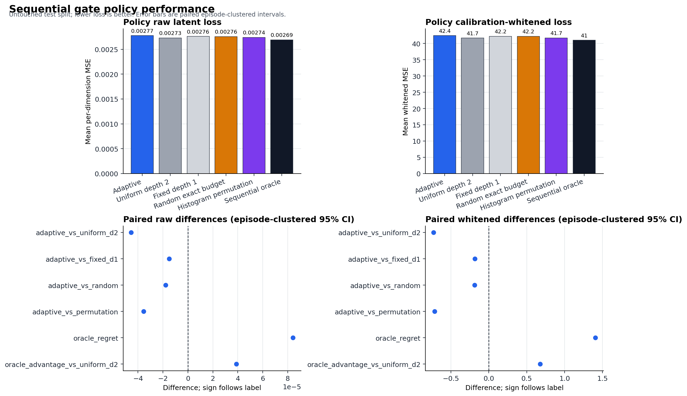
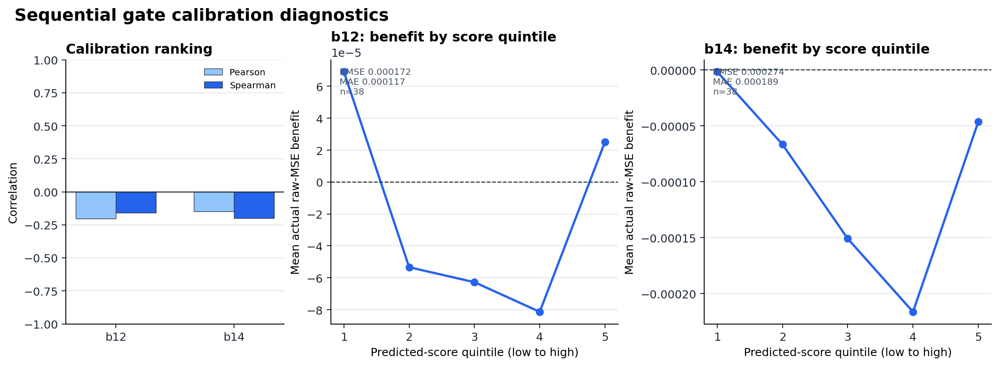
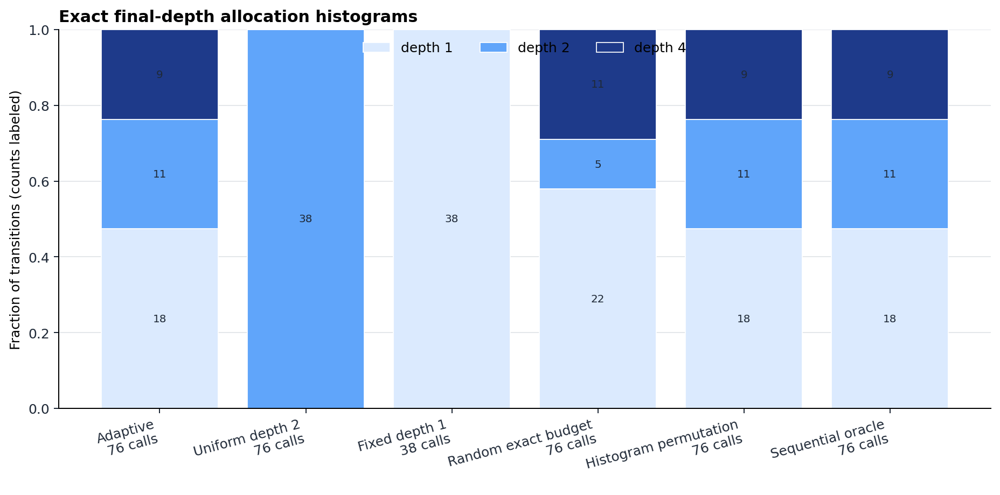
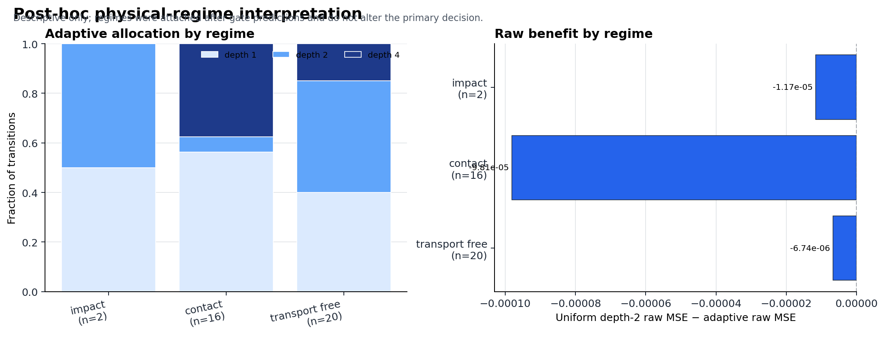

# LeWM Adaptive Compute V2 Report

## Frozen decision

**`sequential_headroom_gate_failed`** — Sequential oracle headroom exists, but the frozen gate failed at least one preregistered raw-MSE comparison or exact-budget requirement.

This is the reserved six-episode engineering smoke run; it supports no scientific claim.

The confirmatory policy executed the first frozen-refiner call for every
transition, then assigned final depths from `{1,2,4}` at exactly `2N` total
calls. The primary claim is transition-selective latent computation, not
physical grounding or contact-specific compute benefit.

## Untouched-test policies

| policy | raw_mean_loss | whitened_mean_loss | depth_1 | depth_2 | depth_4 | total_calls | mean_calls |
| --- | --- | --- | --- | --- | --- | --- | --- |
| adaptive | 0.002774303 | 42.41245 | 18 | 11 | 9 | 76 | 2 |
| uniform_d2 | 0.002728842 | 41.68303 | 0 | 38 | 0 | 76 | 2 |
| fixed_d1 | 0.002759226 | 42.22985 | 38 | 0 | 0 | 38 | 1 |
| random | 0.00275636 | 42.22533 | 22 | 5 | 11 | 76 | 2 |
| permutation | 0.002738696 | 41.69722 | 18 | 11 | 9 | 76 | 2 |
| oracle | 0.002690011 | 41.00671 | 18 | 11 | 9 | 76 | 2 |

## Paired episode-clustered comparisons

Positive benefit favors the named adaptive/oracle side. Intervals are 95%
episode-clustered percentile intervals with the preregistered bootstrap seed.

| comparison | mean_benefit | ci_low | ci_high | n_episodes | diagnostic_only |
| --- | --- | --- | --- | --- | --- |
| adaptive_vs_uniform_d2 | -4.546049e-05 | -4.546049e-05 | -4.546049e-05 | 1 | False |
| adaptive_vs_fixed_d1 | -1.507665e-05 | -1.507665e-05 | -1.507665e-05 | 1 | False |
| adaptive_vs_random | -1.794308e-05 | -1.794308e-05 | -1.794308e-05 | 1 | False |
| adaptive_vs_permutation | -3.560677e-05 | -3.560677e-05 | -3.560677e-05 | 1 | False |
| oracle_regret | 8.429148e-05 | 8.429148e-05 | 8.429148e-05 | 1 | True |
| oracle_advantage_vs_uniform_d2 | 3.8831e-05 | 3.8831e-05 | 3.8831e-05 | 1 | True |

Whitened latent MSE is a calibration-fit sensitivity analysis and does not
override the raw-MSE decision.

## Gate ranking diagnostics

| scope | benefit | pearson | spearman | rmse | mae |
| --- | --- | --- | --- | --- | --- |
| calibration | b12 | -0.2043231 | -0.1578947 | 0.0001724718 | 0.0001170774 |
| calibration | b14 | -0.1500357 | -0.1996936 | 0.0002738631 | 0.0001885019 |
| test_descriptive | b12 | -0.2351861 | -0.2432432 | 0.0001308623 | 8.506039e-05 |
| test_descriptive | b14 | -0.1515109 | -0.1403874 | 0.0002153118 | 0.0001387728 |

Benefit-by-score quantiles are in `metrics/gate_benefit_quantiles.csv`; they are
descriptive on test and calibration evidence only during seed selection.

## Post-hoc physical interpretation

Contact, impact, transport-free, and static labels were attached only after
gate predictions and the exact test allocation were frozen. These results
cannot alter the primary verdict. V1 did not show contact-specific compute
benefit.

| regime | n | mean_depth | depth_1_fraction | depth_2_fraction | depth_4_fraction | mean_gain_vs_depth1 |
| --- | --- | --- | --- | --- | --- | --- |
| impact | 2 | 1.5 | 0.5 | 0.5 | 0 | 1.413985e-05 |
| contact | 16 | 2.1875 | 0.5625 | 0.0625 | 0.375 | -6.538341e-05 |
| transport_free | 20 | 1.9 | 0.4 | 0.45 | 0.15 | 2.22471e-05 |

## Validity and provenance

- Released base config SHA-256: `4d446944fe28922cc2c5763f43d4ef9132a457bd89e9a0ce5dbceac183994999`.
- Released base weights SHA-256: `2839a907362f403f9136383016e91774373a295d958ae75121791f22a9fddf89`.
- V1-selected refiner SHA-256: `388a82fc30c96921083bfa4f2578cb296e6c3544510953d17578cf766cdf10f1`.
- The copied V2 refiner is byte-identical to the V1 source.
- Base and refiner state/frozen audits passed before and after use.
- All prior diagnostic/V1 episodes and reserved smoke episodes were excluded
  from the confirmatory split; all splits are episode-disjoint.
- Gate features contain only causal history/action, z0, z1, the full first
  update, and preregistered convergence/alignment summaries.
- Original LeWM pretraining episode membership remains unknown.
- The sequential target-informed oracle is diagnostic only.

Configuration and machine-readable provenance are in `configuration.json` and
`provenance.json`.

## Compute

- Frozen refiner dense-linear FLOPs per call: `669184`.
- Gate parameters: `168258`.
- Gate dense-linear FLOPs per transition: `336128`.
- Adaptive total refiner calls: `76`.
- Gate allocation overhead median: `0.003618458` s.

## Figures

