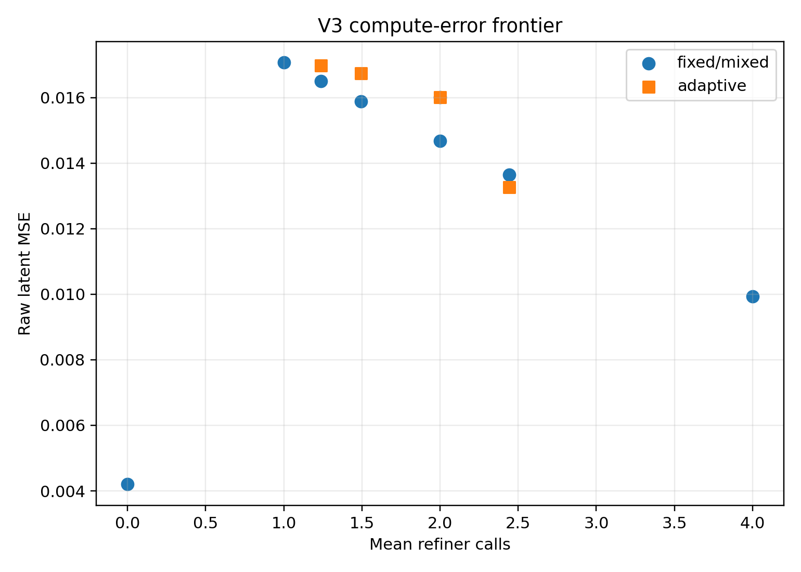
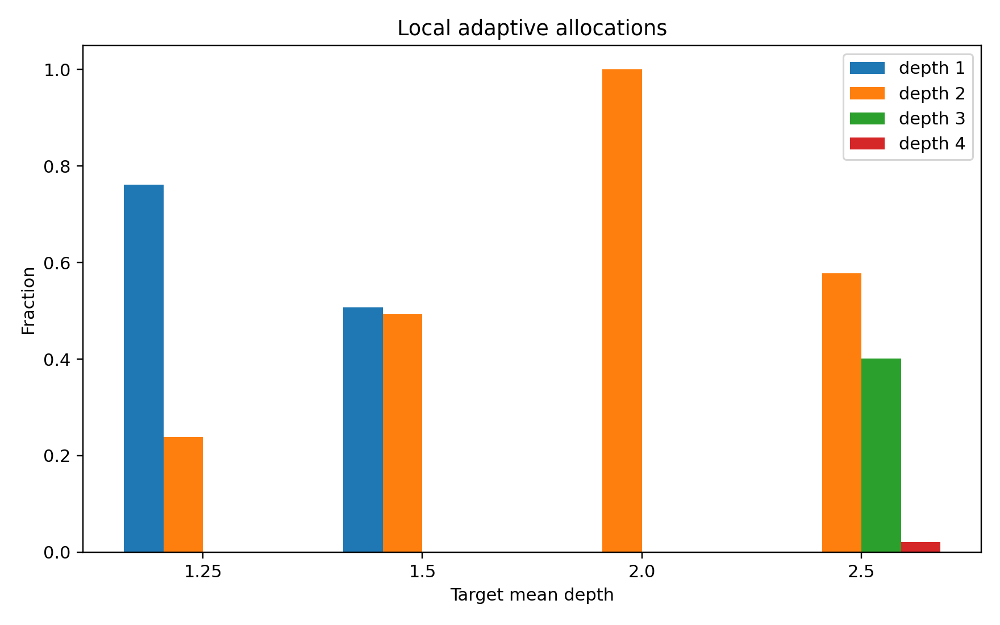
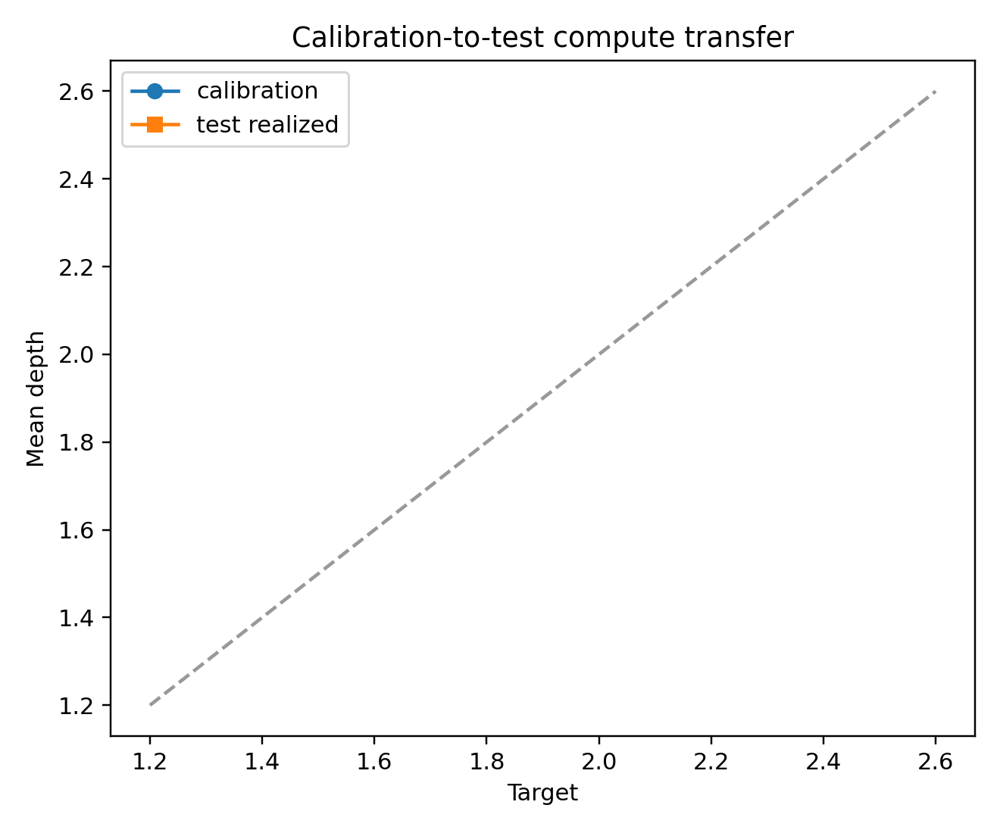
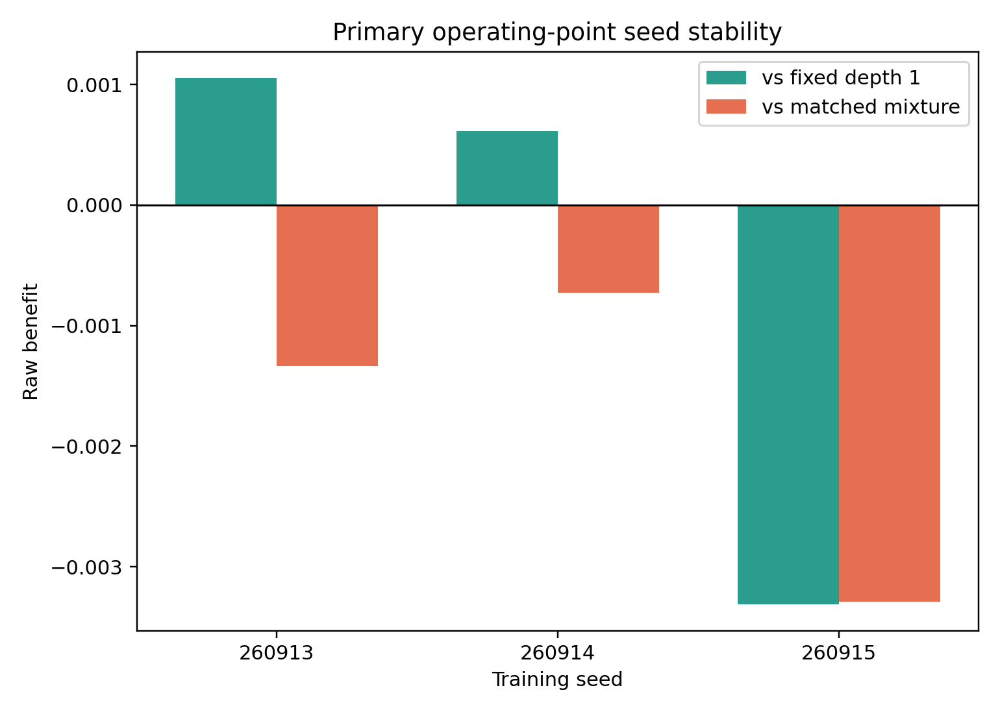

# LeWM Adaptive Compute V3 Scientific Report

## Preregistered verdict

**`adaptive_refiner_headroom_failed`**.

The jointly trained V3 refiner failed before a useful local-halting claim could
be tested. On the fresh 90-episode final test, the frozen LeWM depth-0 raw MSE
was **0.004202734**. The selected V3 seed's fixed depths were much worse:
depth 1 **0.017068058**, depth 2 **0.016016282**, and depth 4 **0.009941946**.
Fixed depth 1 therefore degraded the released LeWM by **0.012865323** raw MSE
(episode-clustered 95% CI **[0.012550061, 0.013198079]** for the degradation).
This triggers the preregistered refiner-headroom failure category.

At the primary target mean depth 2.0, the calibrated local policy realized
exactly 6,840 calls and raw MSE **0.016016282**. It was significantly worse
than the strongest calibration-selected transition-independent mixture at the
same 6,840 calls, MSE **0.014679625**: adaptive benefit
**-0.001336657** (95% CI **[-0.001532896, -0.001149375]**). It did beat its own
bad fixed depth 1, benefit **0.001051776** (95% CI
**[0.000937031, 0.001169234]**), but both policies were dominated by depth 0.

No Pareto improvement was achieved. Every V3 fixed, mixed, and adaptive point
was dominated by the released LeWM depth 0. The matched-call oracle retained a
descriptive advantage over the matched mixture of **0.001710800** (95% CI
**[0.001415867, 0.002009629]**), but even that oracle did not rescue the failed
trained-refiner frontier.

## Primary operating point

| policy | raw MSE | whitened MSE | depth histogram | calls |
| --- | ---: | ---: | --- | ---: |
| released LeWM depth 0 | 0.004202734 | — | 0: 3420 | 0 |
| V3 fixed depth 1 | 0.017068058 | 6.982781 | 1: 3420 | 3420 |
| V3 adaptive | 0.016016282 | 5.618558 | 2: 3420 | 6840 |
| V3 fixed depth 2 | 0.016016282 | 5.618558 | 2: 3420 | 6840 |
| matched mixture | 0.014679625 | 5.173181 | 1: 2280; 4: 1140 | 6840 |
| random same histogram | 0.016016282 | 5.618558 | 2: 3420 | 6840 |
| histogram permutation | 0.016016282 | 5.618558 | 2: 3420 | 6840 |
| descriptive oracle | 0.012968824 | 4.300248 | 1: 1745; 2: 6; 3: 1593; 4: 76 | 6840 |
| V3 fixed depth 4 | 0.009941946 | 1.561871 | 4: 3420 | 13680 |

The primary gate collapsed to uniform depth 2, so its random-histogram and
permutation controls are necessarily identical. This is direct evidence that
the primary operating point did not implement transition-selective compute.
The 1.25, 1.5, and 2.5 target points were nonuniform, but none was nondominated.

## Whitened robustness

Whitened robustness **failed**. At the primary point, adaptive was worse than
the matched mixture by **-0.4453768** whitened MSE (95% CI
**[-0.5711292, -0.3235054]**). Adaptive improved on V3 fixed depth 1 by
**1.3642234** (95% CI **[1.3118997, 1.4199481]**), but again this only compares
two degraded refiner policies. The raw and whitened conclusions agree that V3
did not establish a useful frontier.

## Training and seed stability

All three seeds selected epoch 1 on calibration. Subsequent calibration
objectives increased sharply despite finite checkpoints and early-stopping
restoration:

| seed | selected epoch | selected calibration objective | final epoch-16 objective | adaptive vs matched | adaptive vs fixed d1 |
| ---: | ---: | ---: | ---: | ---: | ---: |
| 260913 | 1 | 13.4424 | 174,143,984.6 | -0.001336657 | 0.001051776 |
| 260914 | 1 | 14.6006 | 82,559,573.5 | -0.000725491 | 0.000612378 |
| 260915 | 1 | 15.9762 | 83,442,192.3 | -0.003288287 | -0.003312356 |

No seed beat its matched mixture. Two of three beat their own fixed depth 1,
while the preregistered seed-aggregated effects were negative both versus the
matched baseline (**-0.001783479**, CI **[-0.001968727, -0.001611899]**) and
fixed depth 1 (**-0.000549401**, CI **[-0.000723445, -0.000382831]**). Seed
robustness therefore **failed**.

This instability is the principal scientific diagnosis. The predeclared joint
objective allowed gate-regression/price gradients to reshape a V1-initialized
refiner immediately; the calibration-restored epoch-1 models had already lost
V1's useful depth-1 behavior. V3 therefore does not isolate a subtle gate
ranking failure. It shows that this joint optimization recipe is not a safe
way to preserve and improve the demonstrated V1/V2 refiner.

## Compute-error frontier

| policy | target/setting | mean calls | raw MSE | nondominated |
| --- | --- | ---: | ---: | --- |
| released LeWM | fixed 0 | 0.0000 | 0.004202734 | yes |
| V3 fixed | depth 1 | 1.0000 | 0.017068058 | no |
| adaptive | 1.25 | 1.2386 | 0.016986223 | no |
| matched mixture | 1.25 | 1.2386 | 0.016499583 | no |
| adaptive | 1.50 | 1.4927 | 0.016742228 | no |
| matched mixture | 1.50 | 1.4927 | 0.015883598 | no |
| adaptive/fixed | 2.00/depth 2 | 2.0000 | 0.016016282 | no |
| matched mixture | 2.00 | 2.0000 | 0.014679625 | no |
| adaptive | 2.50 | 2.4421 | 0.013262114 | no |
| matched mixture | 2.50 | 2.4421 | 0.013646690 | no |
| V3 fixed | depth 4 | 4.0000 | 0.009941946 | no |

Calibration-to-test compute transfer was close for the selected seed: target
means 1.25, 1.5, 2.0, and 2.5 realized 1.2386, 1.4927, 2.0000, and 2.4421.
Thus budget transfer itself was not the reason for failure.

## Compute and measured latency

The primary policy executed exactly 6,840 refiner calls and 6,840 gate
decisions. The analytic counts are 669,184 FLOPs per refiner call and 286,336
per gate decision. Including the common released latent-prediction estimate,
the primary adaptive total was **247.746 GFLOPs** for 3,420 transitions, versus
**245.787 GFLOPs** for the matched mixture. The gate added 0.797% analytic FLOPs.

Five-repeat MPS medians, each including the released LeWM latent prediction:

| policy | calls | total GFLOPs | median batch latency | latency/transition |
| --- | ---: | ---: | ---: | ---: |
| depth 0 | 0 | 241.210 | 0.232516 s | 68.0 us |
| fixed depth 1 | 3420 | 243.498 | 0.263066 s | 76.9 us |
| fixed depth 2 | 6840 | 245.787 | 0.267143 s | 78.1 us |
| matched mixture | 6840 | 245.787 | 0.261332 s | 76.4 us |
| adaptive incl. gate | 6840 | 247.746 | 0.269231 s | 78.7 us |
| fixed depth 4 | 13680 | 250.364 | 0.287293 s | 84.0 us |

Adaptive latency was 3.02% above the matched mixture. FLOP estimates count two
operations per multiply-add and omit normalization/activation scalar work;
latency is the more complete device-level measurement.

## Validity audit

All preregistered validity checks passed:

- exact PLAN/config/checkpoint hashes and strict released-LeWM loading;
- all 18,034,628 base parameters frozen, with extraction before/after state
  audits and unchanged cached base predictions;
- 1,242 prior episodes plus V3 smoke excluded; 420/90/90 full splits pairwise
  episode-disjoint with 38 transitions per episode;
- target/future/physical-label fields absent from the causal feature API;
- row-local decisions invariant to unrelated batch-row mutation;
- calibration-only seed and threshold selection;
- adaptive test allocations persisted before the single test-outcome pass;
- exact primary call matching and deterministic policy replay;
- finite raw/whitened metrics, strict JSON, finite NPZs, and decoded/hash-audited
  figures;
- physical labels attached only after all adaptive allocations froze.

The source HDF5 is 95 GB, so provenance asserts its exact layout and byte size
and hashes the selected cache rather than hashing the entire source file.
Original LeWM pretraining membership remains unavailable. V3 episodes are fresh
to all recorded diagnostics/refiners but cannot be proven absent from original
pretraining.

The existing rollout evaluator could not insert the V3 refiner without an
ambiguous future-action alignment, so multi-step error is explicitly marked
unsupported rather than replaced by an unregistered proxy.

## Post-hoc physical regimes

At the primary point every transition used depth 2, so mean allocation was 2.0
in impact (n=186), contact (n=1,476), free (n=576), and static (n=1,182)
regimes. Gains versus the degraded V3 fixed depth 1 were positive in each
regime, but this uniform allocation cannot support a physical-regime claim.
No contact-specific conclusion is warranted.

## Scientific decision and next experiment

V2's causal ranking signal is not converted into deployable adaptive compute by
this V3 joint objective. The next experiment should treat preservation of the
known-good V1 refiner as a hard constraint: begin from an exact no-regression
checkpoint, train the local gate without refiner gradients, then permit only a
small trust-region or residual-zero joint fine-tune whose calibration gate
requires every fixed exit to remain no worse than its initialization. Loss
components should be normalized to comparable gradient scales and an explicit
abort should fire before checkpoint selection when depth 1 loses the frozen V1
benefit. These are prospective proposals, not post-hoc changes to V3.

## Figures

