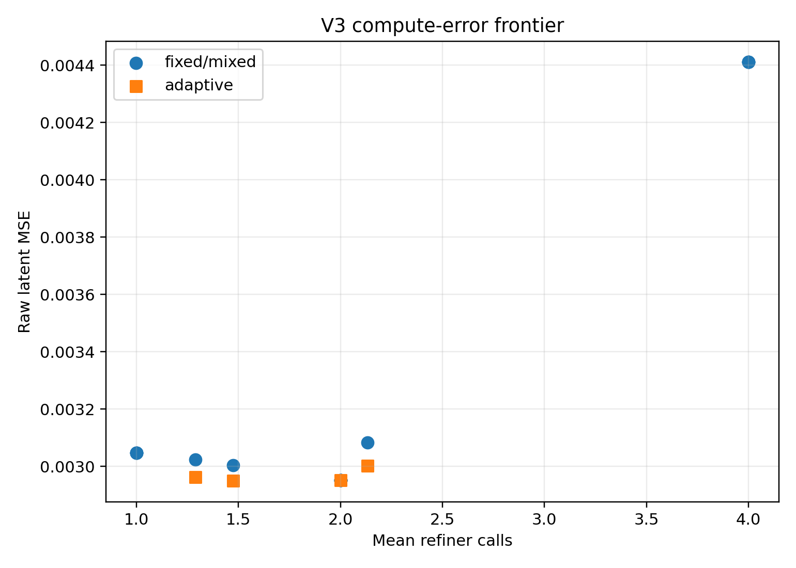
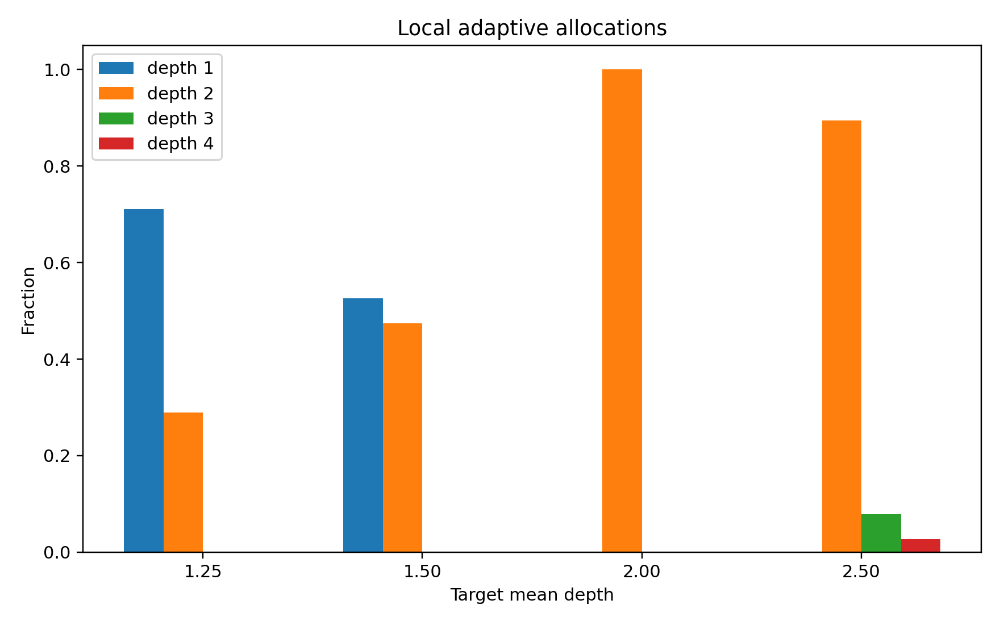
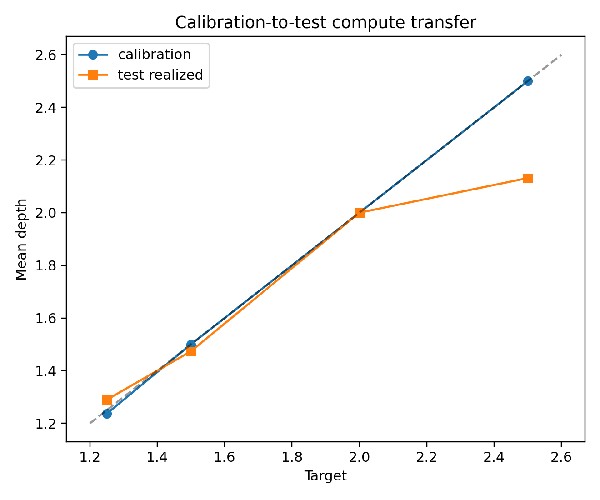
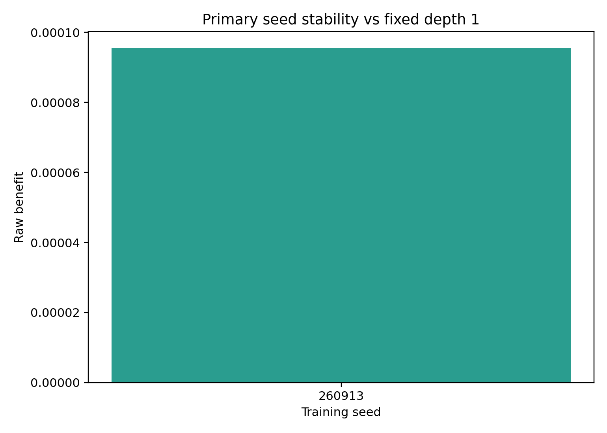
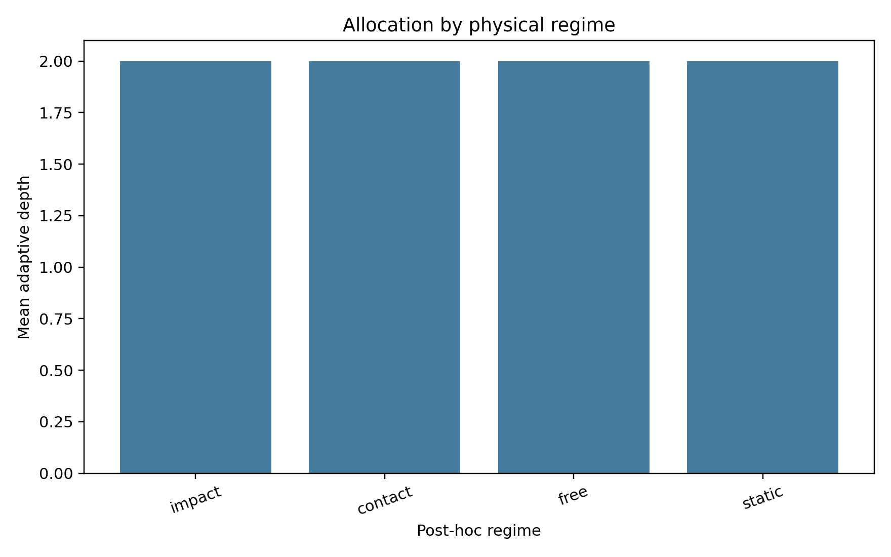

# LeWM Adaptive Compute V3 Report

## Preregistered verdict

**`local_halting_gate_failed`**.

At the primary target mean depth 2.00, the local
adaptive policy realized raw MSE `0.00295156217` versus
`0.00295156217` for the strongest calibration-selected
transition-independent matched-call mixture and `0.00304706092`
for fixed depth 1. Adaptive benefit versus matched was 0 [0, 0];
versus fixed depth 1 it was 9.5498704e-05 [9.5498704e-05, 9.5498704e-05]. The oracle
matched-call advantage was 3.2148731e-05 [3.2148731e-05, 3.2148731e-05].

At least one adaptive point nondominated: **True**.
Whitened robustness: **failed**. Seed robustness:
**failed**.

## Compute and latency

- Primary realized calls: `76`.
- Refiner FLOPs/call: `669184`; gate FLOPs/decision:
  `286336`.
- Total latent-inference FLOPs including the released LeWM predictor estimate:
  `2752728740`.
- MPS end-to-end median latency including released base prediction, gate, and
  refiner: `0.0288502` seconds for
  `38` transitions.

## Compute-error frontier

| policy | operating_point | mean_calls | raw_mse | nondominated |
| --- | --- | --- | --- | --- |
| fixed_d0 | fixed | 0.0 | 0.004018647130578756 | True |
| fixed_d1 | fixed | 1.0 | 0.0030470609199255705 | True |
| fixed_d2 | fixed | 2.0 | 0.0029515621718019247 | False |
| fixed_d4 | fixed | 4.0 | 0.004410810302942991 | False |
| adaptive | 1.25 | 1.2894736842105263 | 0.0029617375694215298 | True |
| matched_mixture | 1.25 | 1.2894736842105263 | 0.0030240584164857864 | False |
| adaptive | 1.50 | 1.4736842105263157 | 0.002949487417936325 | True |
| matched_mixture | 1.50 | 1.4736842105263157 | 0.003003603545948863 | False |
| adaptive | 2.00 | 2.0 | 0.0029515621718019247 | False |
| matched_mixture | 2.00 | 2.0 | 0.0029515621718019247 | False |
| adaptive | 2.50 | 2.1315789473684212 | 0.0030028540641069412 | False |
| matched_mixture | 2.50 | 2.1315789473684212 | 0.0030829543247818947 | False |

## Primary seed stability

| seed | primary_mean_depth | benefit_vs_matched | benefit_vs_fixed_d1 |
| --- | --- | --- | --- |
| 260913 | 2.0 | 0.0 | 9.549869719194248e-05 |

## Post-hoc physical regimes

These labels were attached after every allocation froze. They are descriptive
correlations and do not make the gate contact-aware.

| regime | n | mean_depth | benefit_vs_fixed_d1 |
| --- | --- | --- | --- |
| impact | 2 | 2.0 | 0.00010054872836917639 |
| contact | 16 | 2.0 | 0.00010717022087192163 |
| free | 8 | 2.0 | 3.968497185269371e-05 |
| static | 12 | 2.0 | 0.00011630416702246293 |

## Validity and caveats

All preregistration/hash, prior-exclusion, split-isolation, local-causality,
frozen-backbone, pre-outcome allocation, finite-metric, deterministic replay,
and primary exact-budget audits recorded in `decision.json` passed unless the
verdict explicitly says `validity_or_budget_failed`.

Original LeWM pretraining episode membership is unavailable. The 95-GB source
is bound by asserted layout/size and selected-cache hashes rather than a
whole-file digest. FLOPs omit normalization/activation scalar operations.
Existing rollout code could not insert V3 without an ambiguous protocol, so
multi-step error is explicitly unsupported. Physical analyses are post hoc.

## Figures

