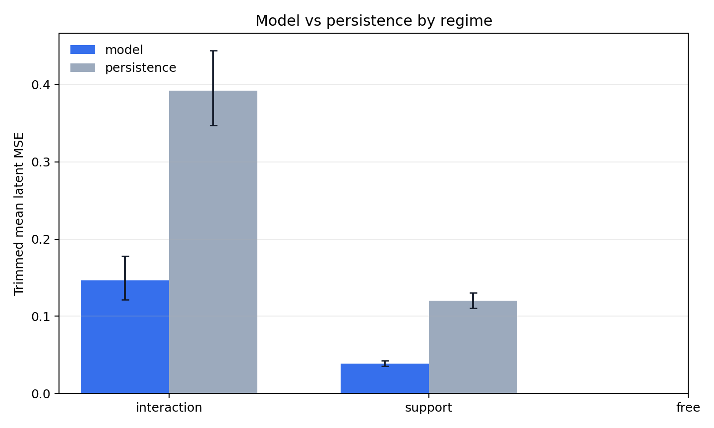
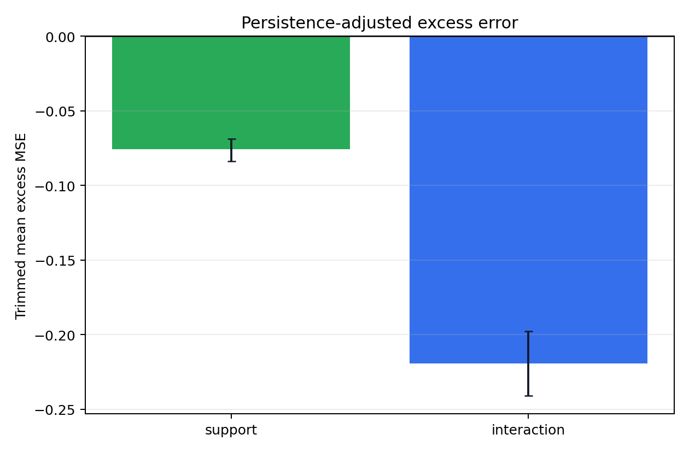
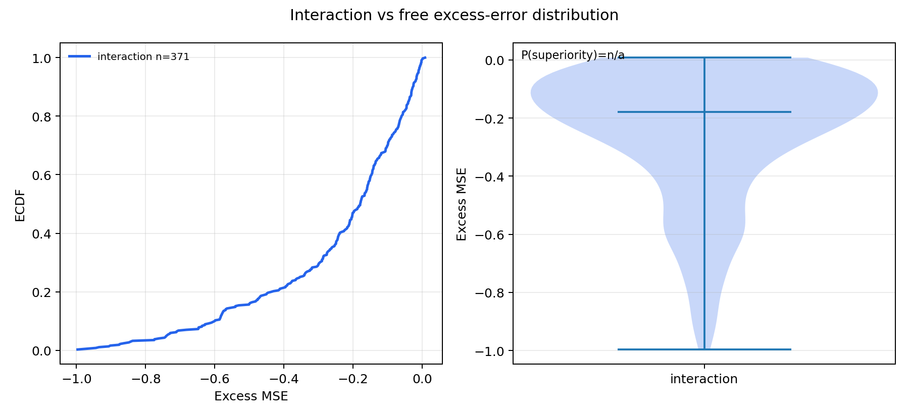
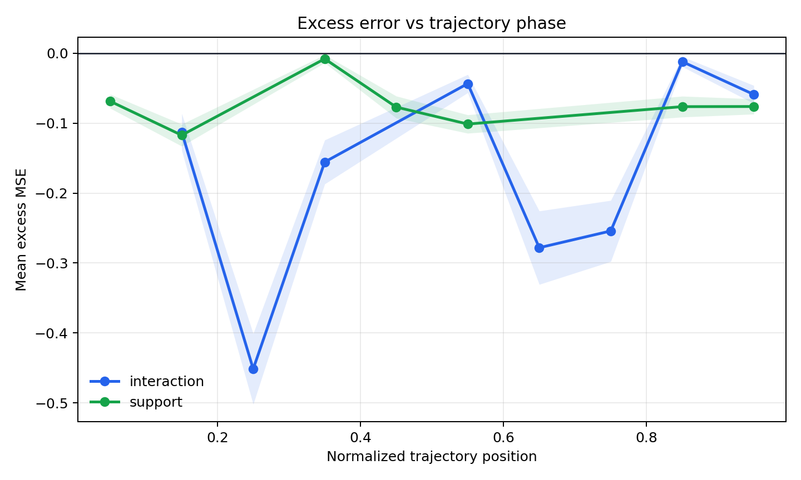
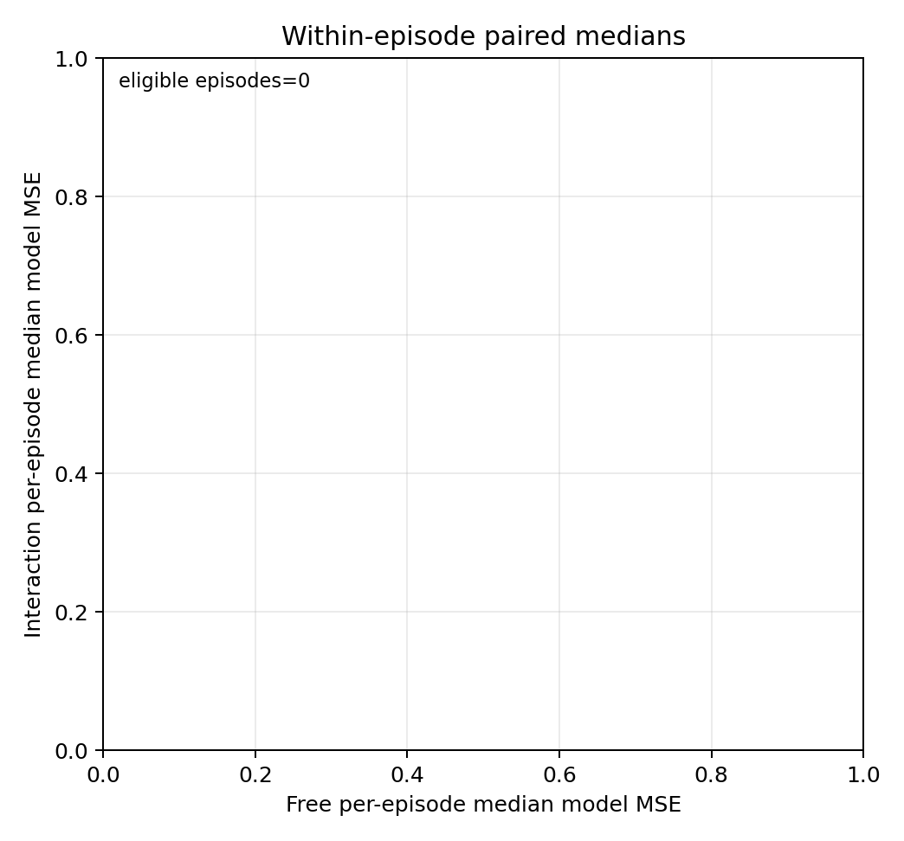
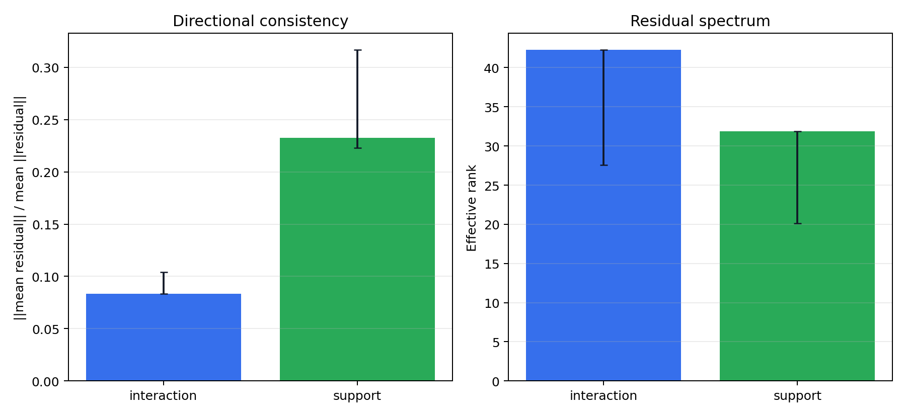

# Cube LeWM Transfer Diagnostic Report

## Summary

Verdict: `contrast_void_insufficient_free`. This Cube latent-space pilot does not overclaim beyond the preregistered gates: held-out interaction/free coverage gate failed, so the preregistered transfer contrast is void. The held-out model/persistence ratio was `0.46526`, and the primary contrast was interaction-vs-free excess trimmed-mean delta nan (CI nan, nan). Headline numbers are sourced to `metrics/*.csv`, `validity_gates.json`, `label_provenance.json`, and `residuals.npz`.

## Label Provenance

- Interaction source: `sensor: proprio_gripper_contact > 1e-9, block-reduced over prediction transition rows`
- Support source: `geometry: privileged_block_0_pos[:,2] <= calibration_median_non_interaction_z + max(0.0025, 10*MAD)`
- Support threshold: `0.0224607` meters
- Gripper geometry agreement at 0.04m: `81.542%`

| split | regime | n_rows | n_episodes |
| --- | --- | --- | --- |
| calibration | support | 196 | 10 |
| calibration | interaction | 184 | 10 |
| heldout | support | 389 | 20 |
| heldout | interaction | 371 | 20 |

## Validity Gates

| gate | passed | reason | model_persistence_ratio | condition_number | per_dim_variance_spread |
| --- | --- | --- | --- | --- | --- |
| collapse_persistence | True | heldout model/persistence ratio=0.46526; void if approximately 1 or worse | 0.46526 | nan | nan |
| latent_isotropy | False | target latent covariance condition and per-dim spread within preregistered thresholds | nan | 517275 | 2.86689 |
| no_circular_labels | True | interaction uses proprio_gripper_contact sensor; support uses block-height geometry only; no velocity/orientation/latent/error labels | nan | nan | nan |
| split_thresholds | True | support threshold and optional whitening are fit on calibration episodes and evaluated on held-out episodes | nan | nan | nan |
| coverage_interaction_free | False | requires >=5 held-out episodes and >=30 held-out rows in both interaction and free | nan | nan | nan |

Because the latent covariance condition-number gate failed, the summary and contrast tables also include calibration-whitened MSE rows (`*_whitened`). Whitening is fit on calibration episodes only.

## Disentangling

High `mse_model` with high `mse_persistence` is representation motion; high `mse_model` with low `mse_persistence` is predictor difficulty. The headline contrast uses `excess = mse_model - mse_persistence`.

| regime | metric | n | n_episodes | trimmed_mean | trimmed_mean_ci_low | trimmed_mean_ci_high | median |
| --- | --- | --- | --- | --- | --- | --- | --- |
| interaction | mse_model | 371 | 20 | 0.146155 | 0.12176 | 0.178042 | 0.0805547 |
| interaction | mse_persistence | 371 | 20 | 0.392115 | 0.347193 | 0.444247 | 0.269157 |
| interaction | excess | 371 | 20 | -0.219387 | -0.241105 | -0.197737 | -0.179205 |
| interaction | mse_model_whitened | 371 | 20 | 44.1514 | 28.2331 | 62.8285 | 19.9094 |
| interaction | mse_persistence_whitened | 371 | 20 | 98.1558 | 57.1376 | 153.322 | 47.9477 |
| interaction | excess_whitened | 371 | 20 | -49.9927 | -79.0656 | -26.8491 | -16.6942 |
| support | mse_model | 389 | 20 | 0.0384723 | 0.035214 | 0.0422627 | 0.0215389 |
| support | mse_persistence | 389 | 20 | 0.120255 | 0.110627 | 0.13024 | 0.109689 |
| support | excess | 389 | 20 | -0.0759328 | -0.0839277 | -0.0688564 | -0.0742289 |
| support | mse_model_whitened | 389 | 20 | 16.8076 | 13.2323 | 23.3297 | 12.7428 |
| support | mse_persistence_whitened | 389 | 20 | 33.9419 | 21.5239 | 52.8001 | 22.6672 |
| support | excess_whitened | 389 | 20 | -12.1264 | -22.6134 | -5.11489 | -4.67586 |
| free | mse_model | 0 | 0 | nan | nan | nan | nan |
| free | mse_persistence | 0 | 0 | nan | nan | nan | nan |
| free | excess | 0 | 0 | nan | nan | nan | nan |
| free | mse_model_whitened | 0 | 0 | nan | nan | nan | nan |
| free | mse_persistence_whitened | 0 | 0 | nan | nan | nan | nan |
| free | excess_whitened | 0 | 0 | nan | nan | nan | nan |

## Regime Contrasts

| contrast | metric | delta_trimmed_mean | delta_trimmed_mean_ci_low | delta_trimmed_mean_ci_high | p_superiority |
| --- | --- | --- | --- | --- | --- |
| interaction_vs_free | mse_model | nan | nan | nan | nan |
| interaction_vs_free | mse_persistence | nan | nan | nan | nan |
| interaction_vs_free | excess | nan | nan | nan | nan |
| interaction_vs_free | mse_model_whitened | nan | nan | nan | nan |
| interaction_vs_free | mse_persistence_whitened | nan | nan | nan | nan |
| interaction_vs_free | excess_whitened | nan | nan | nan | nan |
| support_vs_free | mse_model | nan | nan | nan | nan |
| support_vs_free | mse_persistence | nan | nan | nan | nan |
| support_vs_free | excess | nan | nan | nan | nan |
| support_vs_free | mse_model_whitened | nan | nan | nan | nan |
| support_vs_free | mse_persistence_whitened | nan | nan | nan | nan |
| support_vs_free | excess_whitened | nan | nan | nan | nan |
| interaction_vs_support | mse_model | 0.107683 | 0.081925 | 0.142906 | 0.709532 |
| interaction_vs_support | mse_persistence | 0.27186 | 0.2236 | 0.326548 | 0.739154 |
| interaction_vs_support | excess | -0.143455 | -0.166742 | -0.120994 | 0.24326 |
| interaction_vs_support | mse_model_whitened | 27.3438 | 14.8529 | 41.6876 | 0.633389 |
| interaction_vs_support | mse_persistence_whitened | 64.2139 | 36.2667 | 103.594 | 0.626633 |
| interaction_vs_support | excess_whitened | -37.8663 | -58.7486 | -21.2252 | 0.364034 |

## Phase Control

| contrast | metric | n_deciles | delta_trimmed_mean | delta_trimmed_mean_ci_low | delta_trimmed_mean_ci_high | p_superiority |
| --- | --- | --- | --- | --- | --- | --- |
| interaction_vs_free_phase_decile_adjusted | excess | 0 | nan | nan | nan | nan |

| metric | eligible_episodes | n_pairs | median_episode_delta | fraction_episode_positive | wilcoxon_p_greater |
| --- | --- | --- | --- | --- | --- |
| excess | 0 | 0 | nan | nan | nan |

## Within-Episode Paired Test

| metric | eligible_episodes | fraction_episode_positive | median_delta | wilcoxon_p_greater |
| --- | --- | --- | --- | --- |
| mse_model | 0 | nan | nan | nan |
| excess | 0 | nan | nan | nan |

## Residual Structure

This is a single-checkpoint residual-structure check, not a LeWM ensemble bias-variance decomposition. Systematic or low-rank residuals are consistent with reducible bias but are not proof. The ensemble bias-dominance result was established separately on the state-space Fetch proxy.

| regime | n | directional_consistency | directional_consistency_ci_low | directional_consistency_ci_high | top5_variance | effective_rank |
| --- | --- | --- | --- | --- | --- | --- |
| interaction | 371 | 0.0832737 | 0.0835307 | 0.104142 | 0.33926 | 42.2679 |
| support | 389 | 0.232564 | 0.223041 | 0.316731 | 0.415084 | 31.8822 |
| free | 0 | nan | nan | nan | nan | nan |

## Figures

## Scope And Caveats

- This is latent-space LeWM prediction, not the state-space Fetch proxy.
- This uses one released checkpoint, so a full LeWM bias-variance decomposition is not feasible without pretraining an ensemble of world models.
- This is Cube, not Fetch, and no LeWM Fetch checkpoint is attempted here.
- The prior Cube `4.76519x` number was a raw contact/non-contact MSE ratio; this report separates model MSE from persistence and checks normalized-position phase confounding.
- If the free regime is sparse or absent under non-circular labels, the interaction-vs-free transfer claim is void rather than negative evidence about predictor difficulty.
