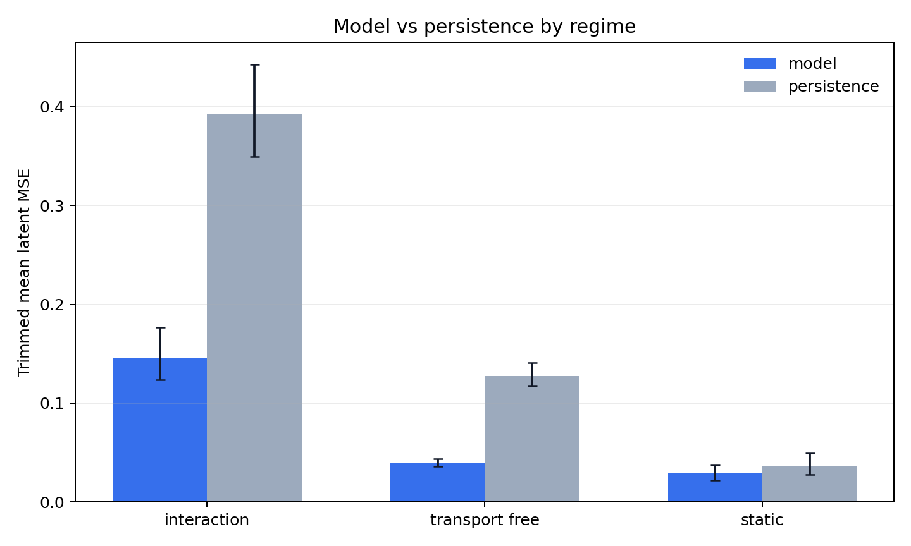
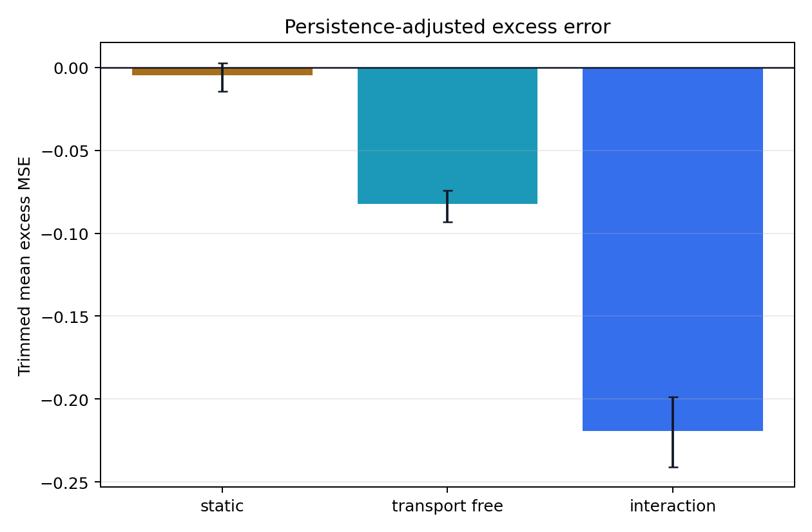
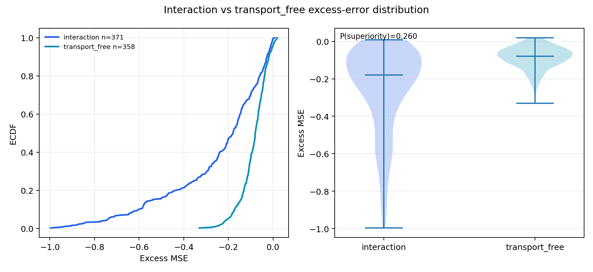
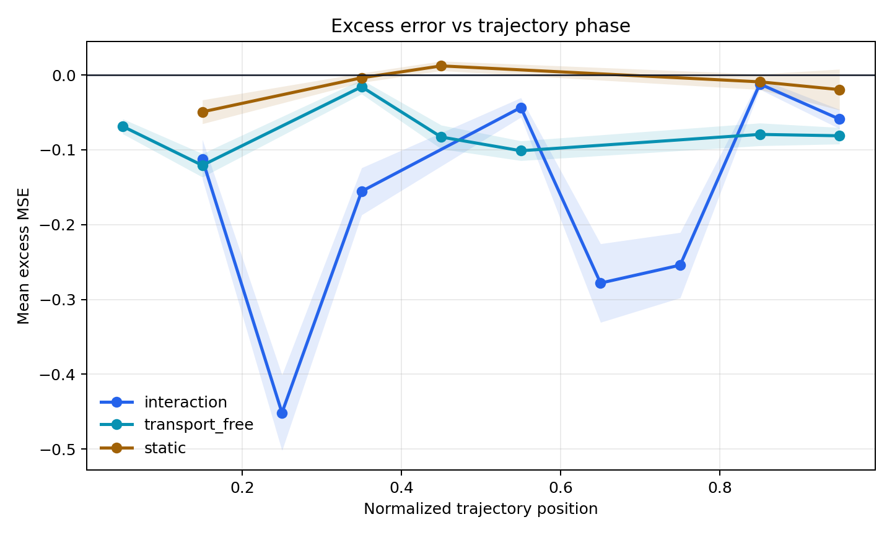
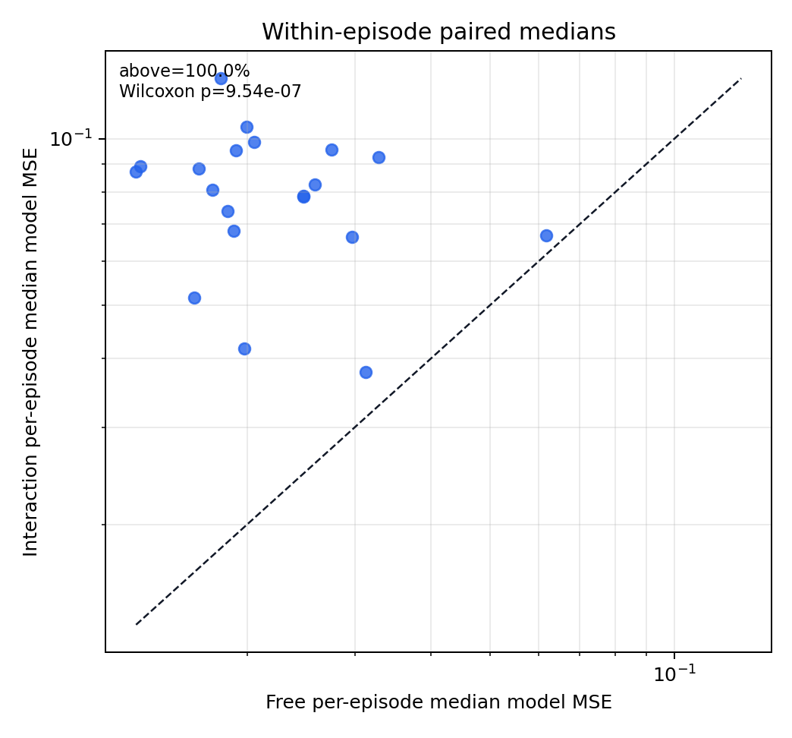
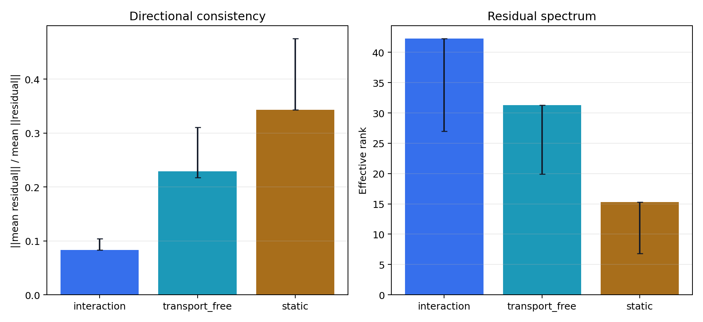

# Cube LeWM Transfer Diagnostic Report - Motion Relabel

## Summary

Verdict: `mixed_phase_control_positive_global_negative`. This is a relabel-and-recompute pass from existing `step_records.csv` and `residuals.npz`; no pixel encoding or model prediction was rerun. The primary interaction-vs-transport_free excess trimmed-mean delta is -0.137055 (CI -0.159978, -0.11677). Decision reason: global interaction-vs-transport_free excess contrast is not positive, but phase-adjusted and matched-position phase controls are positive; preregistered transfer acceptance is not met.

## Label Provenance

- Interaction source: `sensor: proprio_gripper_contact > 1e-9, block-reduced over prediction transition rows`
- Transport/static source: `calibration non-interaction kinematics; transport_free if no gripper contact and effector_disp > effector_p10 or block_disp > max(1mm, block_p95)`
- Effector motion threshold: `0.0196201` m
- Block motion threshold: `0.001` m

| split | regime | n_rows | n_episodes |
| --- | --- | --- | --- |
| calibration | transport_free | 184 | 10 |
| calibration | interaction | 184 | 10 |
| calibration | static | 12 | 7 |
| heldout | transport_free | 358 | 20 |
| heldout | interaction | 371 | 20 |
| heldout | static | 31 | 19 |

## Validity Gates

| gate | passed | reason | model_persistence_ratio | condition_number | per_dim_variance_spread |
| --- | --- | --- | --- | --- | --- |
| collapse_persistence | True | heldout model/persistence ratio=0.46526; void if approximately 1 or worse | 0.46526 | nan | nan |
| latent_isotropy | False | target latent covariance condition and per-dim spread within preregistered thresholds | nan | 517275 | 2.86689 |
| no_circular_labels | True | interaction uses sensor contact; transport_free/static use raw effector/block motion only; no latent/error labels | nan | nan | nan |
| split_thresholds | True | motion thresholds and optional whitening were fit on calibration episodes and evaluated on held-out episodes | nan | nan | nan |
| coverage_interaction_transport_free | True | requires >=5 held-out episodes and >=30 held-out rows in interaction and transport_free | nan | nan | nan |

Because the latent covariance condition-number gate failed, calibration-whitened MSE rows are included.

## Disentangling

| regime | metric | n | n_episodes | trimmed_mean | trimmed_mean_ci_low | trimmed_mean_ci_high | median |
| --- | --- | --- | --- | --- | --- | --- | --- |
| interaction | mse_model | 371 | 20 | 0.146155 | 0.123953 | 0.176401 | 0.0805547 |
| interaction | mse_persistence | 371 | 20 | 0.392115 | 0.349479 | 0.442905 | 0.269157 |
| interaction | excess | 371 | 20 | -0.219387 | -0.240935 | -0.198759 | -0.179205 |
| interaction | mse_model_whitened | 371 | 20 | 44.1514 | 28.5317 | 64.68 | 19.9094 |
| interaction | mse_persistence_whitened | 371 | 20 | 98.1558 | 61.0038 | 154.912 | 47.9477 |
| interaction | excess_whitened | 371 | 20 | -49.9927 | -82.8155 | -26.7151 | -16.6942 |
| transport_free | mse_model | 358 | 20 | 0.039877 | 0.035845 | 0.0438456 | 0.0209397 |
| transport_free | mse_persistence | 358 | 20 | 0.127731 | 0.117476 | 0.140702 | 0.11583 |
| transport_free | excess | 358 | 20 | -0.0823329 | -0.0931677 | -0.0743 | -0.0795723 |
| transport_free | mse_model_whitened | 358 | 20 | 16.6738 | 12.9394 | 22.881 | 12.773 |
| transport_free | mse_persistence_whitened | 358 | 20 | 35.7317 | 22.5537 | 53.678 | 23.4499 |
| transport_free | excess_whitened | 358 | 20 | -13.8845 | -25.7455 | -6.45108 | -5.46257 |
| static | mse_model | 31 | 19 | 0.0292544 | 0.0222092 | 0.0370537 | 0.0246074 |
| static | mse_persistence | 31 | 19 | 0.0368555 | 0.0278887 | 0.0491676 | 0.0443729 |
| static | excess | 31 | 19 | -0.00483001 | -0.0145692 | 0.002757 | -0.0020486 |
| static | mse_model_whitened | 31 | 19 | 18.3432 | 11.5558 | 31.2245 | 12.7428 |
| static | mse_persistence_whitened | 31 | 19 | 16.7494 | 6.69509 | 32.2438 | 5.43106 |
| static | excess_whitened | 31 | 19 | 4.77638 | -2.51602 | 9.13983 | 6.50252 |

## Regime Contrasts

| contrast | metric | delta_trimmed_mean | delta_trimmed_mean_ci_low | delta_trimmed_mean_ci_high | p_superiority |
| --- | --- | --- | --- | --- | --- |
| interaction_vs_transport_free | mse_model | 0.106278 | 0.0816163 | 0.137169 | 0.705612 |
| interaction_vs_transport_free | mse_persistence | 0.264383 | 0.213683 | 0.318433 | 0.724849 |
| interaction_vs_transport_free | excess | -0.137055 | -0.159978 | -0.11677 | 0.260017 |
| interaction_vs_transport_free | mse_model_whitened | 27.4776 | 15.0522 | 42.4717 | 0.63249 |
| interaction_vs_transport_free | mse_persistence_whitened | 62.4242 | 35.5318 | 99.3956 | 0.613915 |
| interaction_vs_transport_free | excess_whitened | -36.1082 | -58.98 | -19.8797 | 0.38165 |
| interaction_vs_static | mse_model | 0.116901 | 0.0926518 | 0.148387 | 0.754804 |
| interaction_vs_static | mse_persistence | 0.355259 | 0.305061 | 0.404175 | 0.904356 |
| interaction_vs_static | excess | -0.214557 | -0.234331 | -0.191287 | 0.0497348 |
| interaction_vs_static | mse_model_whitened | 25.8082 | 12.8443 | 37.6904 | 0.64377 |
| interaction_vs_static | mse_persistence_whitened | 81.4064 | 48.5913 | 127.497 | 0.773498 |
| interaction_vs_static | excess_whitened | -54.7691 | -83.7574 | -33.0035 | 0.160595 |
| transport_free_vs_static | mse_model | 0.0106226 | 0.00084071 | 0.0182435 | 0.547036 |
| transport_free_vs_static | mse_persistence | 0.0908759 | 0.0739592 | 0.106226 | 0.89025 |
| transport_free_vs_static | excess | -0.0775029 | -0.0911511 | -0.0638979 | 0.0938908 |
| transport_free_vs_static | mse_model_whitened | -1.66941 | -10.9528 | 2.82083 | 0.518562 |
| transport_free_vs_static | mse_persistence_whitened | 18.9822 | 8.1085 | 30.4053 | 0.701027 |
| transport_free_vs_static | excess_whitened | -18.6609 | -30.6482 | -9.79347 | 0.226798 |

## Phase Control

| contrast | metric | n_deciles | delta_trimmed_mean | delta_trimmed_mean_ci_low | delta_trimmed_mean_ci_high | p_superiority |
| --- | --- | --- | --- | --- | --- | --- |
| interaction_vs_transport_free_phase_decile_adjusted | excess | 5 | 0.0145112 | 0.00418694 | 0.0247898 | 0.623654 |

| metric | eligible_episodes | n_pairs | median_episode_delta | fraction_episode_positive | wilcoxon_p_greater |
| --- | --- | --- | --- | --- | --- |
| excess | 20 | 76 | 0.022945 | 0.85 | 0.000425339 |

## Within-Episode Paired Test

| metric | eligible_episodes | fraction_episode_positive | median_delta | wilcoxon_p_greater |
| --- | --- | --- | --- | --- |
| mse_model | 20 | 1 | 0.0583888 | 9.53674e-07 |
| excess | 20 | 0 | -0.0946328 | 1 |

## Residual Structure

This remains a single-checkpoint residual-structure check, not a LeWM ensemble bias-variance decomposition.

| regime | n | directional_consistency | directional_consistency_ci_low | directional_consistency_ci_high | top5_variance | effective_rank |
| --- | --- | --- | --- | --- | --- | --- |
| interaction | 371 | 0.0832737 | 0.084067 | 0.104368 | 0.33926 | 42.2679 |
| transport_free | 358 | 0.229326 | 0.21724 | 0.310947 | 0.422696 | 31.2832 |
| static | 31 | 0.343128 | 0.343688 | 0.475275 | 0.567055 | 15.2801 |

## Figures

## Scope And Caveats

- This is Cube latent-space prediction, not Fetch state-space prediction.
- Labels use raw sensor contact and raw kinematic motion only; no latent/error-derived labels are used.
- `transport_free` means no gripper-cube sensor contact and either arm or cube motion above calibration-fitted low-motion thresholds.
- Single checkpoint residual structure is not a bias-variance decomposition.
